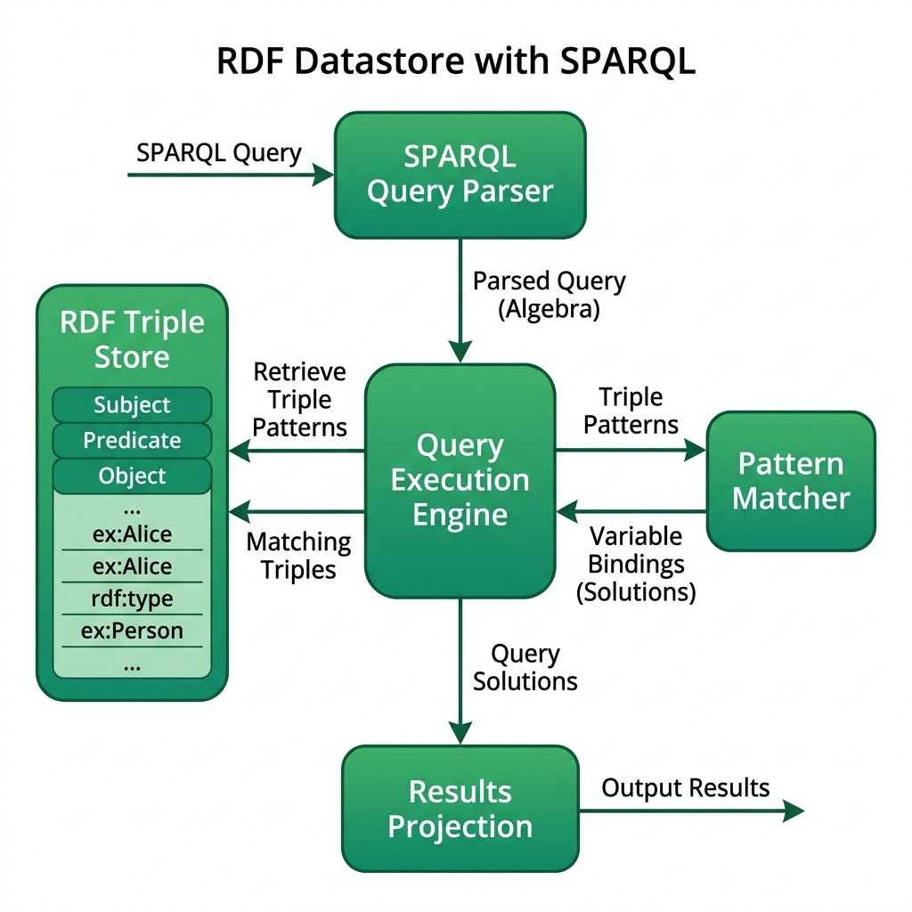

# Implementing a Simple RDF Datastore With Partial SPARQL Support in Racket

This chapter explains a Racket implementation of a simple RDF (Resource Description Framework) datastore with partial SPARQL (SPARQL Protocol and RDF Query Language) support. We'll cover the core RDF data structures, query parsing and execution, helper functions, and the main function with example queries. The file **rdf_sparql.rkt** can be found online at [https://github.com/mark-watson/Racket-AI-book/source-code/simple_RDF_SPARQL](https://github.com/mark-watson/Racket-AI-book/tree/main/source-code/simple_RDF_SPARQL).

Before looking at the code we look at sample use and output. The function **main** demonstrates the usage of the RDF datastore and SPARQL query execution:

```racket
(define (main)
  (set! rdf-store '())

  (add-triple "John" "age" "30")
  (add-triple "John" "likes" "pizza")
  (add-triple "Mary" "age" "25")
  (add-triple "Mary" "likes" "sushi")
  (add-triple "Bob" "age" "35")
  (add-triple "Bob" "likes" "burger")

  (print-all-triples)

  (define (print-query-results query-string)
    (printf "Query: ~a\n" query-string)
    (let ([results (execute-sparql-query query-string)])
      (printf "Final Results:\n")
      (if (null? results)
          (printf "  No results\n")
          (for ([result results])
            (printf "  ~a\n"
                    (string-join
                     (map (lambda (pair)
                            (format "~a: ~a" (car pair) (cdr pair)))
                           result)
                     ", "))))
      (printf "\n")))

  (print-query-results "select * where { ?name age ?age . ?name likes ?food }")
  (print-query-results "select ?s ?o where { ?s likes ?o }")
  (print-query-results "select * where { ?name age ?age . ?name likes pizza }"))

;; Run the main function
(main)
```

This function **main**:

1. Initializes the RDF store with sample data.
2. Prints all triples in the datastore.
3. Defines a `print-query-results` function to execute and display query results.
4. Executes three example SPARQL queries:
   - Query all name-age-food combinations.
   - Query all subject-object pairs for the "likes" predicate.
   - Query all people who like pizza and their ages.

Function **test** generates this output:

```text
All triples in the datastore:
Bob likes burger
Bob age 35
Mary likes sushi
Mary age 25
John likes pizza
John age 30

Query: select * where { ?name age ?age . ?name likes ?food }
Final Results:
  ?age: 35, ?name: Bob, ?food: burger
  ?age: 25, ?name: Mary, ?food: sushi
  ?age: 30, ?name: John, ?food: pizza

Query: select ?s ?o where { ?s likes ?o }
Final Results:
  ?s: Bob, ?o: burger
  ?s: Mary, ?o: sushi
  ?s: John, ?o: pizza

Query: select * where { ?name age ?age . ?name likes pizza }
Final Results:
  ?age: 30, ?name: John
```


## 1. Core RDF Data Structures and Basic Operations

There are two parts to this example in file **rdf_sparql.rkt**: a simple unindexed RDF datastore and a partial SPARQL query implementation that supports compound where clause matches like: **select * where { ?name age ?age . ?name likes pizza }**.

### 1.1 RDF Triple Structure

The foundation of our RDF datastore is the `triple` structure:

```racket
(struct triple (subject predicate object) #:transparent)
```

This structure represents an RDF triple, consisting of a subject, predicate, and object. The `#:transparent` keyword makes the structure's fields accessible for easier debugging and printing.

### 1.2 RDF Datastore

The RDF datastore is implemented as a simple list:

```racket
(define rdf-store '())
```

### 1.3 Basic Operations

Two fundamental operations are defined for the datastore:

1. Adding a triple:

```racket
(define (add-triple subject predicate object)
  (set! rdf-store (cons (triple subject predicate object) rdf-store)))
```

2. Removing a triple:

```racket
(define (remove-triple subject predicate object)
  (set! rdf-store
        (filter (lambda (t)
                  (not (and (equal? (triple-subject t) subject)
                            (equal? (triple-predicate t) predicate)
                            (equal? (triple-object t) object))))
                rdf-store)))
```

## 2. Query Parsing and Execution

### 2.1 SPARQL Query Structure

A simple SPARQL query is represented by the `sparql-query` structure:

```racket
(struct sparql-query (select-vars where-patterns) #:transparent)
```

### 2.2 Query Parsing

First, we need to split the query string into tokens, ignoring the curly braces `{` and `}`. We define a helper `split-string`:

```racket
(define (split-string string [delimiter " "])
  (string-split string delimiter))
```

The `parse-where-patterns` helper parses the WHERE patterns, separating them by periods:

```racket
(define (parse-where-patterns where-clause)
  (let loop ([tokens where-clause]
             [current-pattern '()]
             [patterns '()])
    (cond
      [(null? tokens)
       (if (null? current-pattern)
           (reverse patterns)
           (reverse (cons (reverse current-pattern) patterns)))]
      [(string=? (car tokens) ".")
       (loop (cdr tokens)
             '()
             (if (null? current-pattern)
                 patterns
                 (cons (reverse current-pattern) patterns)))]
      [else
       (loop (cdr tokens)
             (cons (car tokens) current-pattern)
             patterns)])))
```

The main `parse-sparql-query` function takes a query string and converts it into a `sparql-query` structure:

```racket
(define (parse-sparql-query query-string)
  (define tokens (filter (lambda (token) (not (member token '("{" "}") string=?)))
                         (split-string query-string)))
  (define select-index (index-of tokens "select" string-ci=?))
  (define where-index (index-of tokens "where" string-ci=?))
  (define (sublist lst start end)
    (take (drop lst start) (- end start)))
  (define select-vars (sublist tokens (add1 select-index) where-index))
  (define where-clause (drop tokens (add1 where-index)))
  (define where-patterns (parse-where-patterns where-clause))
  (sparql-query select-vars where-patterns))
```

### 2.3 Query Execution

Query execution works recursively. `execute-where-patterns` initiates execution by finding bindings for the first pattern in the `WHERE` clause. Subsequent patterns are matched using `execute-where-patterns-with-bindings`, combining existing variable bindings with new ones:

```racket
;; Execute WHERE patterns with bindings
(define (execute-where-patterns-with-bindings patterns bindings)
  (if (null? patterns)
      (list bindings)
      (let* ([pattern (first patterns)]
             [remaining-patterns (rest patterns)]
             [bound-pattern (apply-bindings pattern bindings)]
             [matching-triples (apply query-triples bound-pattern)])
        (let ([new-bindings (map (lambda (t)
                                   (merge-bindings bindings (triple-to-binding t pattern)))
                                 matching-triples)])
          (if (null? remaining-patterns)
              new-bindings
              (append-map (lambda (binding)
                            (execute-where-patterns-with-bindings remaining-patterns binding))
                          new-bindings))))))

(define (execute-where-patterns patterns)
  (if (null? patterns)
      (list '())
      (let* ([pattern (first patterns)]
             [remaining-patterns (rest patterns)]
             [matching-triples (apply query-triples pattern)])
        (let ([bindings (map (lambda (t) (triple-to-binding t pattern)) matching-triples)])
          (if (null? remaining-patterns)
              bindings
              (append-map (lambda (binding)
                            (let ([results (execute-where-patterns-with-bindings remaining-patterns binding)])
                              (map (lambda (result)
                                     (merge-bindings binding result))
                                   results)))
                          bindings))))))
```

The main query execution function is `execute-sparql-query`:

```racket
(define (execute-sparql-query query-string)
  (let* ([query (parse-sparql-query query-string)]
         [where-patterns (sparql-query-where-patterns query)]
         [select-vars (sparql-query-select-vars query)]
         [results (execute-where-patterns where-patterns)]
         [projected-results (project-results results select-vars)])
    projected-results))
```

This function parses the query, executes the WHERE patterns, and projects the results based on the SELECT variables.

## 3. Helper Functions and Utilities

Several helper functions are implemented to support query execution:

1. `variable?`: Checks if a string is a SPARQL variable (starts with '?').
2. `triple-to-binding`: Converts a triple to a binding based on a pattern.
3. `query-triples`: Filters triples based on a given pattern.
4. `apply-bindings`: Applies bindings to a pattern.
5. `merge-bindings`: Merges two sets of bindings.
6. `project-results`: Projects the final results based on the SELECT variables.
7. `remove-duplicate-bindings`: Removes duplicate bindings for the same variable.
8. `print-all-triples`: Prints all triples in the store.

```racket
(define (variable? str)
  (and (string? str) (> (string-length str) 0) (char=? (string-ref str 0) #\?)))

(define (triple-to-binding t [pattern #f])
  (define binding '())
  (when (and pattern (variable? (first pattern)))
    (set! binding (cons (cons (first pattern) (triple-subject t)) binding)))
  (when (and pattern (variable? (second pattern)))
    (set! binding (cons (cons (second pattern) (triple-predicate t)) binding)))
  (when (and pattern (variable? (third pattern)))
    (set! binding (cons (cons (third pattern) (triple-object t)) binding)))
  binding)

(define (query-triples subject predicate object)
  (filter
   (lambda (t)
    (and
      (or (not subject) (variable? subject) (equal? (triple-subject t) subject))
      (or (not predicate) (variable? predicate)
          (equal? (triple-predicate t) predicate))
      (or (not object) (variable? object) (equal? (triple-object t) object))))
   rdf-store))

(define (apply-bindings pattern bindings)
  (map (lambda (item)
         (if (variable? item)
             (or (dict-ref bindings item #f) item)
             item))
       pattern))

(define (merge-bindings binding1 binding2)
  (append binding1 binding2))

(define (project-results results select-vars)
  (if (equal? select-vars '("*"))
      (map remove-duplicate-bindings results)
      (map (lambda (result)
             (remove-duplicate-bindings
              (map (lambda (var)
                     (cons var (dict-ref result var #f)))
                   select-vars)))
           results)))

(define (remove-duplicate-bindings bindings)
  (remove-duplicates bindings #:key car))

(define (print-all-triples)
  (printf "All triples in the datastore:\n")
  (for ([t rdf-store])
    (printf "~a ~a ~a\n"
            (triple-subject t)
            (triple-predicate t)
            (triple-object t)))
  (printf "\n"))
```


The following diagram shows the high-level architecture of the RDF datastore and SPARQL query engine implemented in this chapter:

{width: "100%"}


## Conclusion

This implementation provides a basic framework for an RDF datastore with partial SPARQL support in Racket. While it lacks many features of a full-fledged RDF database and SPARQL engine, it demonstrates the core concepts and can serve as a starting point for more complex implementations. The code is simple and can be fun experimenting with.

## Optional Practice Problems

1. **Persistent Storage**: Currently, the RDF triples in `rdf_sparql.rkt` are stored entirely in memory in the `rdf-store` list. Implement functions to serialize the triples to a file (such as in NTriples or simple CSV format) and load them back during initialization.
2. **FILTER Clause Support**: Extend the SPARQL parser and query execution engine to support a basic `FILTER` statement (e.g., filtering string values by regex or numeric variables by comparison operators like `<` or `>`).
3. **Support for UNION Queries**: Modify `execute-where-patterns` to handle basic `UNION` blocks, allowing a query to match one of multiple sub-patterns and merge their resulting bindings.