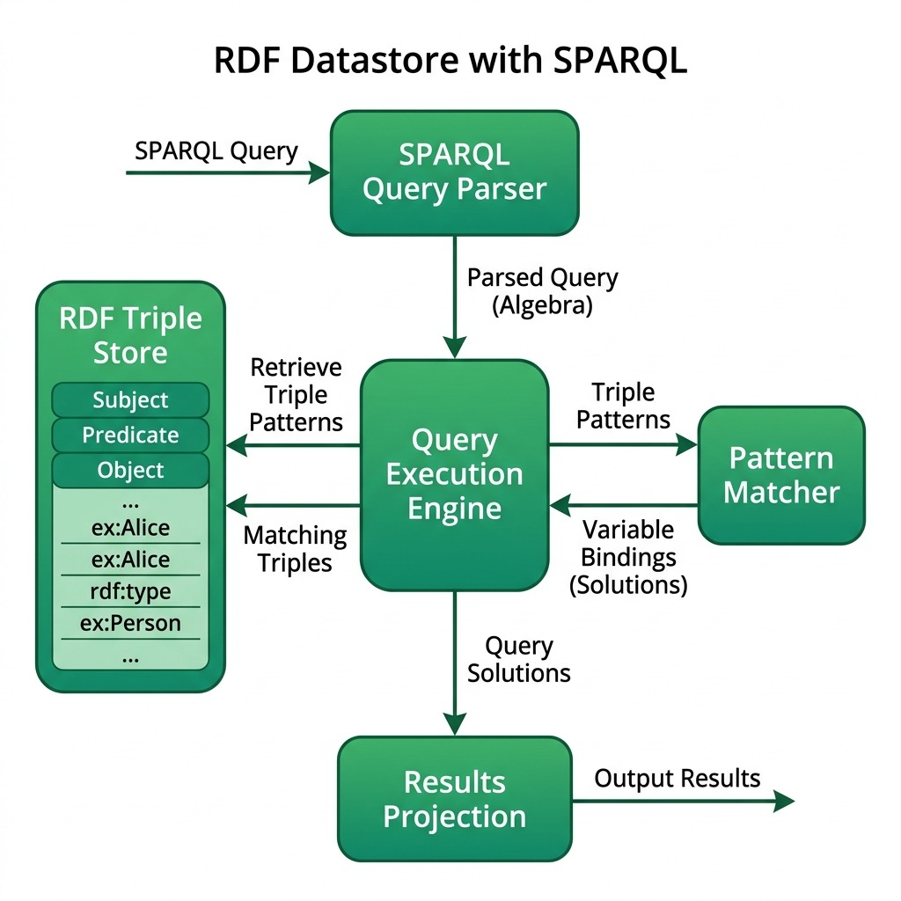

# Implementing a Simple RDF Datastore With Partial SPARQL Support in Racket

This chapter explains a Racket implementation of a simple RDF (Resource Description Framework) datastore with partial SPARQL (SPARQL Protocol and RDF Query Language) support. We'll cover the core RDF data structures, query parsing and execution, helper functions, and the main function with example queries. The file **rdf_sparql.rkt** can be found online at [https://github.com/mark-watson/Racket-AI-book/source-code/simple_RDF_SPARQL](https://github.com/mark-watson/Racket-AI-book/tree/main/source-code/simple_RDF_SPARQL).

RDF reduces all knowledge to one shape, the triple: subject, predicate, object. "John is 30 years old" and "John likes pizza" both fit the same mold. That uniformity is the point. Once everything is a triple, one tiny query language can ask questions about any domain without a custom schema or a custom query layer for each new kind of fact. Real knowledge graph systems such as DBpedia and Wikidata store billions of triples; the ideas in this chapter are the same ideas, scaled down until every line fits in your head.

A note on scope: this engine implements the SPARQL subset made of `SELECT`, a `WHERE` clause, and triple patterns joined on shared variables. It does not implement IRIs, URIs, typed literals, `OPTIONAL`, `UNION`, or the HTTP protocol. What you get instead is a complete, readable implementation of the heart of every triple store: pattern matching with joins.

Before looking at the code we look at sample use and output. The function **main** demonstrates the usage of the RDF datastore and SPARQL query execution:

```racket
(define (main)
  (set! rdf-store '())

  (add-triple "John" "age" "30")
  (add-triple "John" "likes" "pizza")
  (add-triple "Mary" "age" "25")
  (add-triple "Mary" "likes" "sushi")
  (add-triple "Bob" "age" "35")
  (add-triple "Bob" "likes" "burger")

  (print-all-triples)

  (define (print-query-results query-string)
    (printf "Query: ~a\n" query-string)
    (let ([results (execute-sparql-query query-string)])
      (printf "Final Results:\n")
      (if (null? results)
          (printf "  No results\n")
          (for ([result results])
            (printf "  ~a\n"
                    (string-join
                     (map (lambda (pair)
                            (format "~a: ~a" (car pair) (cdr pair)))
                           result)
                     ", "))))
      (printf "\n")))

  (print-query-results "select * where { ?name age ?age . ?name likes ?food }")
  (print-query-results "select ?s ?o where { ?s likes ?o }")
  (print-query-results "select * where { ?name age ?age . ?name likes pizza }"))

;; Run the demo when this file is the main program:
(module+ main
  (main))
```

This function **main**:

1. Initializes the RDF store with sample data.
2. Prints all triples in the datastore.
3. Defines a `print-query-results` function to execute and display query results.
4. Executes three example SPARQL queries:
   - Query all name-age-food combinations.
   - Query all subject-object pairs for the "likes" predicate.
   - Query all people who like pizza and their ages.

Function **main** generates this output:

```text
All triples in the datastore:
Bob likes burger
Bob age 35
Mary likes sushi
Mary age 25
John likes pizza
John age 30

Query: select * where { ?name age ?age . ?name likes ?food }
Final Results:
  ?age: 35, ?name: Bob, ?food: burger
  ?age: 25, ?name: Mary, ?food: sushi
  ?age: 30, ?name: John, ?food: pizza

Query: select ?s ?o where { ?s likes ?o }
Final Results:
  ?s: Bob, ?o: burger
  ?s: Mary, ?o: sushi
  ?s: John, ?o: pizza

Query: select * where { ?name age ?age . ?name likes pizza }
Final Results:
  ?age: 30, ?name: John
```

Look at the first query output for a moment, because it contains the single most important idea in this chapter. The pattern `?name age ?age . ?name likes ?food` mentions `?name` twice. The query engine only returns rows where both patterns agree on the value of `?name`: we never see "Bob, 35, sushi" because no triple says Bob likes sushi. Matching two patterns on a shared variable is a *join*, and joins are what turn a bag of loose facts into a graph you can navigate. The engine below is, at heart, three things: a tokenizer, a pattern matcher over one triple pattern, and a loop that joins bindings across patterns.

The file doubles as a library. The `(module+ main ...)` wrapper at the bottom runs the demo only when you execute `racket rdf_sparql.rkt` directly; when another module **require**s the file, only the definitions load. That is what lets the extensions and test suite later in this chapter reuse the engine without copying it.


## 1. Core RDF Data Structures and Basic Operations

There are two parts to this example in file **rdf_sparql.rkt**: a simple unindexed RDF datastore and a partial SPARQL query implementation that supports compound where clause matches like: **select * where { ?name age ?age . ?name likes pizza }**.

### 1.1 RDF Triple Structure

The foundation of our RDF datastore is the `triple` structure:

```racket
(struct triple (subject predicate object) #:transparent)
```

This structure represents an RDF triple, consisting of a subject, predicate, and object. The `#:transparent` keyword makes the structure's fields accessible for easier debugging and printing.

### 1.2 RDF Datastore

The RDF datastore is implemented as a simple list:

```racket
(define rdf-store '())
```

### 1.3 Basic Operations

Two fundamental operations are defined for the datastore:

1. Adding a triple:

```racket
(define (add-triple subject predicate object)
  (set! rdf-store (cons (triple subject predicate object) rdf-store)))
```

2. Removing a triple:

```racket
(define (remove-triple subject predicate object)
  (set! rdf-store
        (filter (lambda (t)
                  (not (and (equal? (triple-subject t) subject)
                            (equal? (triple-predicate t) predicate)
                            (equal? (triple-object t) object))))
                rdf-store)))
```

## 2. Query Parsing and Execution

### 2.1 SPARQL Query Structure

A simple SPARQL query is represented by the `sparql-query` structure:

```racket
(struct sparql-query (select-vars where-patterns) #:transparent)
```

### 2.2 Query Parsing

First, we need to split the query string into tokens, ignoring the curly braces `{` and `}`. We define a helper `split-string`:

```racket
(define (split-string string [delimiter " "])
  (string-split string delimiter))
```

The `parse-where-patterns` helper parses the WHERE patterns, separating them by periods:

```racket
(define (parse-where-patterns where-clause)
  (let loop ([tokens where-clause]
             [current-pattern '()]
             [patterns '()])
    (cond
      [(null? tokens)
       (if (null? current-pattern)
           (reverse patterns)
           (reverse (cons (reverse current-pattern) patterns)))]
      [(string=? (car tokens) ".")
       (loop (cdr tokens)
             '()
             (if (null? current-pattern)
                 patterns
                 (cons (reverse current-pattern) patterns)))]
      [else
       (loop (cdr tokens)
             (cons (car tokens) current-pattern)
             patterns)])))
```

The main `parse-sparql-query` function takes a query string and converts it into a `sparql-query` structure:

```racket
(define (parse-sparql-query query-string)
  (define tokens (filter (lambda (token) (not (member token '("{" "}") string=?)))
                         (split-string query-string)))
  (define select-index (index-of tokens "select" string-ci=?))
  (define where-index (index-of tokens "where" string-ci=?))
  (define (sublist lst start end)
    (take (drop lst start) (- end start)))
  (define select-vars (sublist tokens (add1 select-index) where-index))
  (define where-clause (drop tokens (add1 where-index)))
  (define where-patterns (parse-where-patterns where-clause))
  (sparql-query select-vars where-patterns))
```

### 2.3 Query Execution

Query execution works recursively. `execute-where-patterns` initiates execution by finding bindings for the first pattern in the `WHERE` clause. Subsequent patterns are matched using `execute-where-patterns-with-bindings`, combining existing variable bindings with new ones:

```racket
;; Execute WHERE patterns with bindings
(define (execute-where-patterns-with-bindings patterns bindings)
  (if (null? patterns)
      (list bindings)
      (let* ([pattern (first patterns)]
             [remaining-patterns (rest patterns)]
             [bound-pattern (apply-bindings pattern bindings)]
             [matching-triples (apply query-triples bound-pattern)])
        (let ([new-bindings (map (lambda (t)
                                   (merge-bindings bindings (triple-to-binding t pattern)))
                                 matching-triples)])
          (if (null? remaining-patterns)
              new-bindings
              (append-map (lambda (binding)
                            (execute-where-patterns-with-bindings remaining-patterns binding))
                          new-bindings))))))

(define (execute-where-patterns patterns)
  (if (null? patterns)
      (list '())
      (let* ([pattern (first patterns)]
             [remaining-patterns (rest patterns)]
             [matching-triples (apply query-triples pattern)])
        (let ([bindings (map (lambda (t) (triple-to-binding t pattern)) matching-triples)])
          (if (null? remaining-patterns)
              bindings
              (append-map (lambda (binding)
                            (let ([results (execute-where-patterns-with-bindings remaining-patterns binding)])
                              (map (lambda (result)
                                     (merge-bindings binding result))
                                   results)))
                          bindings))))))
```

The main query execution function is `execute-sparql-query`:

```racket
(define (execute-sparql-query query-string)
  (let* ([query (parse-sparql-query query-string)]
         [where-patterns (sparql-query-where-patterns query)]
         [select-vars (sparql-query-select-vars query)]
         [results (execute-where-patterns where-patterns)]
         [projected-results (project-results results select-vars)])
    projected-results))
```

This function parses the query, executes the WHERE patterns, and projects the results based on the SELECT variables.

## 3. Helper Functions and Utilities

Several helper functions are implemented to support query execution:

1. `variable?`: Checks if a string is a SPARQL variable (starts with '?').
2. `triple-to-binding`: Converts a triple to a binding based on a pattern.
3. `query-triples`: Filters triples based on a given pattern.
4. `apply-bindings`: Applies bindings to a pattern.
5. `merge-bindings`: Merges two sets of bindings.
6. `project-results`: Projects the final results based on the SELECT variables.
7. `remove-duplicate-bindings`: Removes duplicate bindings for the same variable.
8. `print-all-triples`: Prints all triples in the store.

```racket
(define (variable? str)
  (and (string? str) (> (string-length str) 0) (char=? (string-ref str 0) #\?)))

(define (triple-to-binding t [pattern #f])
  (define binding '())
  (when (and pattern (variable? (first pattern)))
    (set! binding (cons (cons (first pattern) (triple-subject t)) binding)))
  (when (and pattern (variable? (second pattern)))
    (set! binding (cons (cons (second pattern) (triple-predicate t)) binding)))
  (when (and pattern (variable? (third pattern)))
    (set! binding (cons (cons (third pattern) (triple-object t)) binding)))
  binding)

(define (query-triples subject predicate object)
  (filter
   (lambda (t)
    (and
      (or (not subject) (variable? subject) (equal? (triple-subject t) subject))
      (or (not predicate) (variable? predicate)
          (equal? (triple-predicate t) predicate))
      (or (not object) (variable? object) (equal? (triple-object t) object))))
   rdf-store))

(define (apply-bindings pattern bindings)
  (map (lambda (item)
         (if (variable? item)
             (or (dict-ref bindings item #f) item)
             item))
       pattern))

(define (merge-bindings binding1 binding2)
  (append binding1 binding2))

(define (project-results results select-vars)
  (if (equal? select-vars '("*"))
      (map remove-duplicate-bindings results)
      (map (lambda (result)
             (remove-duplicate-bindings
              (map (lambda (var)
                     (cons var (dict-ref result var #f)))
                   select-vars)))
           results)))

(define (remove-duplicate-bindings bindings)
  (remove-duplicates bindings #:key car))

(define (print-all-triples)
  (printf "All triples in the datastore:\n")
  (for ([t rdf-store])
    (printf "~a ~a ~a\n"
            (triple-subject t)
            (triple-predicate t)
            (triple-object t)))
  (printf "\n"))
```

## 4. How a Join Actually Runs, Step by Step

The query engine deserves one slow walk-through, because the two functions `execute-where-patterns` and `execute-where-patterns-with-bindings` are the whole engine, and everything else is plumbing. Take this query against the demo data:

```text
select * where { ?name age ?age . ?name likes pizza }
```

A *binding* is an association list pairing variable names with values. Every row of a result is one binding list.

**Step 1: match the first pattern.** `execute-where-patterns` takes the first pattern `("?name" "age" "?age")` and hands it to `query-triples`, which scans the store and keeps triples whose predicate is `age`. Three triples match. `triple-to-binding` turns each match into a binding list:

```racket
(((?age . "35") (?name . "Bob"))
 ((?age . "25") (?name . "Mary"))
 ((?age . "30") (?name . "John")))
```

**Step 2: extend each binding through the remaining patterns.** For each of those three rows, `execute-where-patterns-with-bindings` takes the second pattern `("?name" "likes" "pizza")` and calls `apply-bindings` to substitute what is already known. For Bob's row, `?name` is bound to `"Bob"`, so the pattern becomes the concrete `("Bob" "likes" "pizza")`. `query-triples` scans the store for that exact triple and finds nothing, because Bob likes burger. Bob's row dies here, and that is a join working as intended: binding lists with no extension are simply dropped.

For John's row, the bound pattern is `("John" "likes" "pizza")`, which does exist in the store. `triple-to-binding` produces one new binding (nothing new, in fact: every variable in the second pattern was already bound or is a literal), and `merge-bindings` appends it to John's existing row. John's row survives and moves on.

**Step 3: project.** `project-results` receives the surviving binding lists and either keeps every variable (for `select *`) or keeps only the variables named in `select`, dropping duplicates with `remove-duplicate-bindings`.

The shape to notice is the classic generate-and-test loop written functionally. Each remaining pattern maps over the list of partial rows, and `append-map` concatenates the per-row results into one flat list. An empty pattern list returns `(list bindings)`, the base case that says "this row matched everything." A pattern with no matching triples returns an empty list, which `append-map` silently absorbs. No exceptions, no special cases: failed branches just vanish.

This is also why the engine is a teaching tool rather than a database. Every pattern match is a full scan of `rdf-store`, so a query with three patterns over a million triples scans three million triples. A production triple store indexes on subject, predicate, and object so a bound pattern like `("John" "likes" "pizza")` is a single hash lookup. The join algorithm would be identical; only the index changes.

### The Library Interface

The `provide` block at the top of **rdf_sparql.rkt** exports the full engine so other modules can build on it:

```racket
(provide (struct-out triple)
         (struct-out sparql-query)
         rdf-store
         set-rdf-store!
         add-triple
         remove-triple
         variable?
         triple-to-binding
         query-triples
         print-all-triples
         apply-bindings
         merge-bindings
         parse-where-patterns
         parse-sparql-query
         project-results
         remove-duplicate-bindings
         execute-where-patterns
         execute-sparql-query)
```

The rest of this chapter uses exactly these exports, nothing more, which is a good sign that the interface is complete.

## 5. Saving and Loading Triples: N-Triples Persistence

An in-memory store forgets everything when the process exits. The file **rdf_extended.rkt**, also in the **simple_RDF_SPARQL** directory, fixes that with the simplest serialization RDF has: N-Triples, one triple per line, subject and predicate and object separated by spaces, each line ending with a period. A line of our store on disk looks like:

```text
"John" "likes" "pizza" .
```

The extended module requires the original engine and builds on it:

```racket
#lang racket

;;; Copyright (C) 2026 Mark Watson <markw@markwatson.com>
;;; Apache 2 License
;;;
;;; Extensions to the simple RDF datastore in rdf_sparql.rkt:
;;;
;;;   - N-Triples persistence: save and load a store as plain text
;;;   - FILTER support: filter query results with Racket predicates
;;;   - A larger example dataset: a small family/food knowledge graph
;;;
;;; Run the demo:  racket rdf_extended.rkt
;;; Run tests:     raco test tests.rkt

(require "rdf_sparql.rkt")

(provide triples->ntriples-string
         save-store
         load-store
         execute-sparql-query-filtered
         comparison->predicate
         populate-demo-store
         print-bindings)

;;; -----------------------------------------------------------------------------
;;; N-Triples Persistence
;;;
;;; N-Triples is the simplest RDF serialization: one triple per line,
;;; subject predicate object, ending with a period. Our version keeps
;;; every node as a quoted string, which is enough for this datastore.

(define (triple->ntriple-line t)
  (format "\"~a\" \"~a\" \"~a\" ."
          (triple-subject t)
          (triple-predicate t)
          (triple-object t)))

(define (triples->ntriples-string triples)
  (string-join (map triple->ntriple-line triples) "\n" #:after-last "\n"))

(define (save-store [path "store.nt"])
  "Save the current rdf-store to PATH in N-Triples format."
  (call-with-output-file path
    (lambda (out) (display (triples->ntriples-string rdf-store) out))
    #:exists 'replace))

(define ntriple-line-rx
  (pregexp "^\"([^\"]*)\"\\s+\"([^\"]*)\"\\s+\"([^\"]*)\"\\s*\\.\\s*$"))

(define (parse-ntriple-line line)
  "Parse one N-Triples line into a triple, or #f for blank/comment lines."
  (let ([m (regexp-match ntriple-line-rx line)])
    (and m (triple (second m) (third m) (fourth m)))))

(define (load-store path)
  "Load triples from PATH (N-Triples format) into rdf-store.
   Returns the number of triples loaded."
  (set-rdf-store! '())
  (for ([line (file->lines path)])
    (let ([t (parse-ntriple-line line)])
      (when t
        (set-rdf-store! (cons t rdf-store)))))
  (length rdf-store))
```

The writer is three lines: format each triple, join with newlines, and write. The reader is the part worth reading slowly. The regexp captures three quoted strings, and anything that does not match returns `#f`, which `load-store` skips. Blank lines and trailing junk therefore never crash a load; worst case they are silently ignored, which is what you want when a file has been hand-edited.

### A Larger Demo Dataset

Six triples cannot show off joins, so **rdf_extended.rkt** defines a small knowledge graph of five people, their ages, foods they like, and a `knows` relation among them:

```racket
(define demo-triples
  '(("John" "age" "30")
    ("John" "likes" "pizza")
    ("John" "knows" "Mary")
    ("John" "knows" "Bob")
    ("Mary" "age" "25")
    ("Mary" "likes" "sushi")
    ("Mary" "knows" "Alice")
    ("Bob" "age" "35")
    ("Bob" "likes" "burger")
    ("Bob" "knows" "Mary")
    ("Alice" "age" "41")
    ("Alice" "likes" "sushi")
    ("Alice" "knows" "John")
    ("Carol" "age" "17")
    ("Carol" "likes" "pizza")
    ("Carol" "knows" "John")))

(define (populate-demo-store)
  (set-rdf-store! '())
  (for ([row demo-triples])
    (apply add-triple row)))
```

The `knows` relation turns the store from a table into a graph, and graph queries are where triple stores shine. "What foods do the friends of my friends like?" is one query:

```text
select ?person ?friend ?food where { ?person knows ?friend . ?friend likes ?food }
```

Run it and the engine chains both patterns through the shared variable `?friend`:

```text
Query: people and the foods liked by someone they know
       (two-hop join over knows and likes)
  ?person: Carol, ?friend: John, ?food: pizza
  ?person: Alice, ?friend: John, ?food: pizza
  ?person: Bob, ?friend: Mary, ?food: sushi
  ?person: Mary, ?friend: Alice, ?food: sushi
  ?person: John, ?friend: Bob, ?food: burger
  ?person: John, ?friend: Mary, ?food: sushi
```

Each row is a path of length two through the graph. Adding a third pattern such as `?friend age ?age` would extend every row again, and rows whose friend has no age triple would drop out. Multi-hop path queries in SQL need self-joins with aliases; here they are one line.

## 6. Adding FILTER to the Engine

Real SPARQL puts `FILTER(?age > 30)` inside the `WHERE` clause. Our parser splits patterns on periods and would choke on that syntax, so **rdf_extended.rkt** takes a simpler route that keeps the engine untouched: run the query as usual, then filter the resulting binding lists with an ordinary Racket predicate:

```racket
;;; -----------------------------------------------------------------------------
;;; FILTER Support
;;;
;;; Real SPARQL has FILTER(expr) inside WHERE. We add a simple post-query
;;; form: execute the query as usual, then keep only result rows where the
;;; predicate applied to the variable bindings returns true.

(define (comparison->predicate op column threshold)
  "Build a predicate on bindings comparing the value bound to COLUMN
   (parsed as a number) with THRESHOLD using OP (<, >, <=, >=, =)."
  (define cmp
    (match op
      ["<" <] [">" >] ["<=" <=] [">=" >=] ["=" =]
      [_ (error (format "unknown comparison operator: ~a" op))]))
  (lambda (bindings)
    (let ([raw (dict-ref bindings column #f)])
      (and raw
           (let ([n (string->number raw)])
             (and n (cmp n threshold)))))))

(define (execute-sparql-query-filtered query-string keep?)
  "Execute QUERY-STRING and keep only result rows for which KEEP?,
   a predicate on a binding list, returns true."
  (filter keep? (execute-sparql-query query-string)))
```

Filtering after the query is less efficient than filtering inside it, since the engine materializes every result row first. For a teaching engine the trade is fine: `comparison->predicate` gets clear behavior for free. `"25"` converts to a number and can be compared; `"Mary"` converts to `#f` through `string->number` and the row is dropped rather than crashing; a missing binding is dropped the same way. A filter can never break the engine.

One subtlety you will hit if you write filters yourself: the projection in a query controls what the filter can see. A query of `select ?name where { ?name age ?age }` projects only `?name`, so the returned rows contain no `?age` key for a filter to test. Project the columns you filter on, as the demos do, or move filtering into the pattern loop itself, which is one of the practice problems.

Here is the full demo run of **rdf_extended.rkt**, showing the friends-of-friends query, a filtered query, and a save/clear/reload round trip:

```text
$ racket rdf_extended.rkt
All triples in the datastore:
Carol knows John
Carol likes pizza
Carol age 17
Alice knows John
Alice likes sushi
Alice age 41
Bob knows Mary
Bob likes burger
Bob age 35
Mary knows Alice
Mary likes sushi
Mary age 25
John knows Bob
John knows Mary
John likes pizza
John age 30

Query: people and the foods liked by someone they know
       (two-hop join over knows and likes)
  ?person: Carol, ?friend: John, ?food: pizza
  ?person: Alice, ?friend: John, ?food: pizza
  ?person: Bob, ?friend: Mary, ?food: sushi
  ?person: Mary, ?friend: Alice, ?food: sushi
  ?person: John, ?friend: Bob, ?food: burger
  ?person: John, ?friend: Mary, ?food: sushi

Query with FILTER: friends older than 30 and what they like
  ?person: Mary, ?friend: Alice, ?age: 41, ?food: sushi
  ?person: John, ?friend: Bob, ?age: 35, ?food: burger

Saved and cleared the store; it now holds 0 triples.
Reloaded 16 triples from store.nt.

Query after reload: everyone who likes sushi
  ?name: Mary
  ?name: Alice
```

The filtered query keeps only Alice (age 41) and Bob (age 35) from the six friend rows. The persistence round trip proves the reload by re-asking a question whose answer survives an empty store only if the load worked.

## 7. Testing the Engine

The query engine is pure functions over a global list, which makes it easy to test thoroughly. The file **tests.rkt** in the same directory uses the built-in **rackunit** library and exercises each layer: store mutation, the tokenizer, single-pattern matches, joins, binding helpers, persistence, and filters:

```racket
#lang racket

;;; Copyright (C) 2026 Mark Watson <markw@markwatson.com>
;;; Apache 2 License
;;;
;;; Tests for rdf_sparql.rkt and rdf_extended.rkt

(require rackunit)
(require "rdf_sparql.rkt")
(require "rdf_extended.rkt")

;;; -----------------------------------------------------------------------------
;;; Store operations

(test-case "add and remove triples"
  (set-rdf-store! '())
  (add-triple "John" "likes" "pizza")
  (add-triple "Mary" "likes" "sushi")
  (check-equal? (length rdf-store) 2)
  (remove-triple "John" "likes" "pizza")
  (check-equal? (length rdf-store) 1)
  (check-equal? (triple-object (car rdf-store)) "sushi"))

;;; -----------------------------------------------------------------------------
;;; Parser

(test-case "variables are detected"
  (check-true (variable? "?name"))
  (check-false (variable? "name"))
  (check-false (variable? ""))
  (check-false (variable? 42)))

(test-case "where patterns split on periods"
  (check-equal?
   (parse-where-patterns '("?name" "age" "?age" "." "?name" "likes" "?food"))
   '(("?name" "age" "?age") ("?name" "likes" "?food")))
  ;; trailing period and empty patterns are both fine
  (check-equal?
   (parse-where-patterns '("?s" "likes" "?o" "."))
   '(("?s" "likes" "?o"))))

(test-case "parse a full query"
  (define q (parse-sparql-query "select ?s ?o where { ?s likes ?o }"))
  (check-equal? (sparql-query-select-vars q) '("?s" "?o"))
  (check-equal? (sparql-query-where-patterns q) '(("?s" "likes" "?o")))
  ;; keywords are case-insensitive
  (define q2 (parse-sparql-query "SELECT * WHERE { ?s likes ?o }"))
  (check-equal? (sparql-query-select-vars q2) '("*")))

;;; -----------------------------------------------------------------------------
;;; Query execution

(define (setup-food-store)
  (set-rdf-store! '())
  (add-triple "John" "age" "30")
  (add-triple "John" "likes" "pizza")
  (add-triple "Mary" "age" "25")
  (add-triple "Mary" "likes" "sushi")
  (add-triple "Bob" "age" "35")
  (add-triple "Bob" "likes" "burger"))

(test-case "single pattern query"
  (setup-food-store)
  (define results (execute-sparql-query "select ?s ?o where { ?s likes ?o }"))
  (check-equal? (length results) 3))

(test-case "join on shared variable"
  (setup-food-store)
  (define results
    (execute-sparql-query
     "select ?name where { ?name age ?age . ?name likes pizza }"))
  (check-equal? (length results) 1)
  (check-equal? (dict-ref (car results) "?name") "John"))

(test-case "query with no matches returns empty list, not an error"
  (setup-food-store)
  (check-equal? (execute-sparql-query "select ?s where { ?s dislikes ?o }")
                '()))

(test-case "literal in subject position"
  (setup-food-store)
  (define results
    (execute-sparql-query "select ?p ?o where { Bob ?p ?o }"))
  (check-equal? (length results) 2))

(test-case "select * keeps all bound variables"
  (setup-food-store)
  (define results
    (execute-sparql-query "select * where { ?name age ?age }"))
  (check-equal? (length results) 3)
  (for ([row results])
    (check-equal? (length row) 2)))

;;; -----------------------------------------------------------------------------
;;; Bindings helpers

(test-case "apply-bindings substitutes known variables"
  (check-equal? (apply-bindings '("?s" "likes" "?o")
                                '(("?s" . "John")))
                '("John" "likes" "?o")))

(test-case "triple-to-binding only binds variables"
  (define t (triple "John" "likes" "pizza"))
  (check-equal? (triple-to-binding t '("?s" "likes" "?o"))
                '(("?o" . "pizza") ("?s" . "John")))
  (check-equal? (triple-to-binding t '("?s" "likes" "pizza"))
                '(("?s" . "John"))))

;;; -----------------------------------------------------------------------------
;;; N-Triples persistence

(define test-file "test-store.nt")

(test-case "N-Triples round trip"
  (setup-food-store)
  (save-store test-file)
  (define saved-lines (file->lines test-file))
  (check-equal? (length saved-lines) 6)
  ;; every line is subject predicate object period
  (check-true
   (andmap (lambda (line)
             (regexp-match? #px"^\"[^\"]*\" \"[^\"]*\" \"[^\"]*\" \\.$" line))
           saved-lines))
  (set-rdf-store! '())
  (check-equal? (length rdf-store) 0)
  (check-equal? (load-store test-file) 6)
  ;; same query as before the save gives the same answer
  (define results
    (execute-sparql-query "select ?name where { ?name likes sushi }"))
  (check-equal? (length results) 1)
  (check-equal? (dict-ref (car results) "?name") "Mary"))

(test-case "bad lines are skipped, not fatal"
  (call-with-output-file test-file
    (lambda (out)
      (displayln "\"a\" \"b\" \"c\" ." out)
      (displayln "" out)
      (displayln "this is not a triple" out)
      (displayln "\"d\" \"e\" \"f\" ." out))
    #:exists 'replace)
  (check-equal? (load-store test-file) 2))

(when (file-exists? test-file) (delete-file test-file))

;;; -----------------------------------------------------------------------------
;;; FILTER support

(test-case "numeric comparisons"
  (define older-than-30 (comparison->predicate ">" "?age" 30))
  (check-true (older-than-30 '(("?age" . "41"))))
  (check-false (older-than-30 '(("?age" . "25"))))
  (check-false (older-than-30 '(("?age" . "not-a-number"))))
  (check-false (older-than-30 '(("?other" . "41")))))

(test-case "filtered query keeps only matching rows"
  (populate-demo-store)
  (define results
    (execute-sparql-query-filtered
     "select ?name ?age where { ?name age ?age }"
     (comparison->predicate ">=" "?age" 30)))
  (define names (sort (map (lambda (r) (dict-ref r "?name")) results)
                      string<?))
  (check-equal? names '("Alice" "Bob" "John")))

(displayln "\nAll tests passed.")
```

Run the suite with `raco test`:

```text
$ raco test tests.rkt
raco test: "tests.rkt"

All tests passed.
15 tests passed
```

Two tests here carry most of the weight. The "query with no matches" test pins the most important contract of the engine: a query that matches nothing returns the empty list and never raises, which is how multi-pattern joins silently drop dead branches. The "bad lines are skipped" test does the same for the loader, guaranteeing a hand-edited file cannot bring down a query session.

Running the tests also caught a real design trap while this chapter was being written. The first version of the filtered-query test selected only `?name` and then tried to filter on `?age`, and got every row wrong because projection had already discarded the ages. If you extend this engine and your filters suddenly match nothing, check your `select` list first.


The following diagram shows the high-level architecture of the RDF datastore and SPARQL query engine implemented in this chapter:

{width: "100%"}


## Conclusion

This implementation provides a basic framework for an RDF datastore with partial SPARQL support in Racket. While it lacks many features of a full-fledged RDF database and SPARQL engine, it demonstrates the core concepts: triples as a universal data shape, pattern matching as query, shared variables as joins, and N-Triples as a human-readable file format. The extended module adds persistence and result filtering, and the test suite pins the contracts that make the engine safe to build on. From here, every missing feature, such as indexes, `OPTIONAL`, `UNION`, or remote endpoints, is an increment, not a rewrite.

## Optional Practice Problems

1. **Index the Store**: Replace the `rdf-store` list scan in `query-triples` with three hash tables indexed by subject, predicate, and object. When a pattern has a bound subject, predicate, or object, use the corresponding index instead of scanning. Time `select * where { ?name age ?age . ?name likes ?food }` over 100,000 generated triples before and after your change.
2. **Parse FILTER Inside WHERE**: Extend `parse-sparql-query` so a pattern list can end with the tokens `FILTER ( ?age > 30 )`, and extend the execution loop to apply the comparison at that point. This is the version of filtering that prunes rows early instead of after projection.
3. **Support for UNION Queries**: Modify `execute-where-patterns` to handle basic `UNION` blocks, allowing a query to match one of multiple sub-patterns and merge their resulting bindings.
4. **DISTINCT and ORDER BY**: Add support for `select distinct ?name ...` and a trailing `order by ?age`, so `select distinct ?food where { ?who likes ?food } order by ?food` lists each food once, sorted.
5. **Typed Literals**: Our N-Triples writer stores `"30"` as a string, so age comparisons must call `string->number` on every row. Extend the store to keep a typed value alongside each object (integer, string), read and write real N-Triples typed literals like `"30"^^<http://www.w3.org/2001/XMLSchema#integer>`, and make `comparison->predicate` skip the conversion for integer-typed values.
6. **A mini Wikidata**: Download a small N-Triples extract from a public source (or export one from a SPARQL endpoint), load it with `load-store`, and write three interesting queries against it. Which parts of the loaded data did our limited parser have to discard, and why?