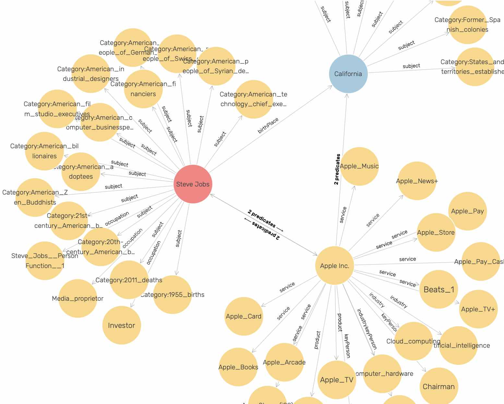

# Knowledge Graph Navigator {#kgn}

The Knowledge Graph Navigator (which I will often refer to as KGN) is a tool for processing a set of entity names and automatically exploring the public Knowledge Graph [DBPedia](http://dbpedia.org) using SPARQL queries. I started to write KGN for my own use to automate some things I used to do manually when exploring Knowledge Graphs, and later thought that KGN might be also useful for educational purposes. KGN shows the user the auto-generated SPARQL queries so hopefully the user will learn by seeing examples. KGN uses the SPARQL queries. I cover SPARQL and linked data/knowledge Graphs is previous books I have written and while I give you a brief background here, I ask interested users to look at either for more details:

- The chapter **Knowledge Graph Navigator** in my book **Loving Common Lisp, or the Savvy Programmer’s Secret Weapon**
- The chapters **Background Material for the Semantic Web and Knowledge Graphs**, **Knowledge Graph Navigator** in my book **Practical Artificial Intelligence Programming With Clojure**

We use the Natural Language Processing (NLP) library from the last chapter to find human and place names in input text and  then construct SPARQL queries to access data from DBPedia.

I have implemented parts of KGN in several languages: Common Lisp, Java, Clojure, Racket Scheme, Swift, Python, and Hy. The most full featured version of KGN, including a full user interface, is featured in my book [Loving Common Lisp, or the Savvy Programmer's Secret Weapon](https://leanpub.com/lovinglisp) that you can read free online. That version performs more speculative SPARQL queries to find information compared to the example here that I designed for ease of understanding, and modification. I am not covering the basics of RDF data and SPARQL queries here. While I provide sufficient background material to understand the code, please read the relevant chapters in my Common Lisp book for more background material.

We will be running an example using data containing three person entities, one company entity, and one place entity. The following figure shows a very small part of the DBPedia Knowledge Graph that is centered around these entities. The data for this figure was collected by an example Knowledge Graph Creator from my Common Lisp book:



I chose to use DBPedia instead of WikiData for this example because DBPedia URIs are human readable. The following URIs represent the concept of a *person*. The semantic meanings of DBPedia and FOAF (friend of a friend) URIs are self-evident to a human reader while the WikiData URI is not:

{linenos=off}
~~~~~~~~
http://www.wikidata.org/entity/Q215627
http://dbpedia.org/ontology/Person
http://xmlns.com/foaf/0.1/name
~~~~~~~~

I frequently use WikiData in my work and WikiData is one of the most useful public knowledge bases. I have both DBPedia and WikiData SPARQL endpoints in the example code that we will look at later, with the WikiData endpoint comment out. You can try manually querying WikiData at the [WikiData SPARQL endpoint](https://query.wikidata.org). For example, you might explore the WikiData URI for the *person* concept using:

{lang=sparql, linenos=off}
~~~~~~~~
select ?p ?o where {
 <http://www.wikidata.org/entity/Q215627> ?p ?o .
} limit 10
~~~~~~~~

For the rest of this chapter we will just use DBPedia or data copied from DBPedia.

After looking at an interactive session using the example program for this chapter we will look at the implementation.

## Entity Types Handled by KGN

To keep this example simple we handle just three entity types:

- People
- Organizations
- Places
 
In addition to finding detailed information for people, organizations, and places we will also search for relationships between entities. This search process consists of generating a series of SPARQL queries and calling the DBPedia SPARQL endpoint.


TBD


## KGN Implementation

The example application works processing a list or Person, Place, and Organization names. We generate SPARQL queries to DBPedia to find information about the entities and relationships between them.

We are using two libraries developed for this book that can be found in the directories **Racket-AI-book-code/sparql** and **Racket-AI-book-code/nlp** to supply support for SPARQL queries and natural language processing.

### SPARQL Client Library

We already looked at code examples for making simple SPARQL queries in the chapter **Datastores** and here we continue with more examples that we need to the KGN application.

The following listing shows **Racket-AI-book-code/sparql/sparql.rkt** where we implement several functions for interacting with DBPedia's SPARQL endpoint. There are two functions **sparql-dbpedia-for-person** and **sparql-dbpedia-person-uri** crafted for constructing SPARQL queries. The function **sparql-dbpedia-for-person** takes a person URI and formulates a query to fetch associated website links and comments, limiting the results to four. On the other hand, the function **sparql-dbpedia-person-uri** takes a person name and builds a query to obtain the person's URI and comments from DBpedia. Both functions utilize string manipulation to embed the input parameters into the SPARQL query strings.

Another function **sparql-query->hash** executes SPARQL queries against the DBPedia endpoint. It takes a SPARQL query string as an argument, sends an HTTP request to the DBpedia SPARQL endpoint, and expects a JSON response. The **call/input-url** function is used to send the request, with **uri-encode** ensuring the query string is URL-encoded. The response is read from the port, converted to a JSON expression using the function **string->jsexpr**, and is expected to be in a hash form which is returned by this function.

Lastly, there are two functions **json->listvals** and **gd** for processing the JSON response from DBPedia. The function **json->listvals** extracts the variable bindings from the SPARQL result and organizes them into lists. The function **gd** further processes these lists based on the number of variables in the query result, creating lists of lists which represent the variable bindings in a structured way. The **sparql-dbpedia** function serves as an interface to these functionalities, taking a SPARQL query string, executing the query via **sparql-query->hash**, and processing the results through **gd** to provide a structured output. This arrangement encapsulates the process of querying DBPedia and formatting the results, making it convenient for further use within a Racket program.

```racket
(provide sparql-dbpedia-person-uri)
(provide sparql-query->hash)
(provide json->listvals)
(provide sparql-dbpedia)

(require net/url)
(require net/uri-codec)
(require json)
(require racket/pretty)

(define (sparql-dbpedia-for-person person-uri)
  @string-append{
     SELECT
      (GROUP_CONCAT(DISTINCT ?website; SEPARATOR="  |  ")
                                   AS ?website) ?comment {
      OPTIONAL {
       @person-uri
       <http://www.w3.org/2000/01/rdf-schema#comment>
       ?comment . FILTER (lang(?comment) = 'en')
      } .
      OPTIONAL {
       @person-uri
       <http://dbpedia.org/ontology/wikiPageExternalLink>
       ?website
        . FILTER( !regex(str(?website), "dbpedia", "i"))
      }
     } LIMIT 4})

(define (sparql-dbpedia-person-uri person-name)
  @string-append{
    SELECT DISTINCT ?personuri ?comment {
      ?personuri
        <http://xmlns.com/foaf/0.1/name>
        "@person-name"@"@"en .
      ?personuri
        <http://www.w3.org/2000/01/rdf-schema#comment>
        ?comment .
             FILTER  (lang(?comment) = 'en') .
}})


(define (sparql-query->hash query)
  (call/input-url
   (string->url
    (string-append
     "https://dbpedia.org/sparql?query="
     (uri-encode query)))
   get-pure-port
   (lambda (port)
     (string->jsexpr (port->string port)))
   '("Accept: application/json")))

(define (json->listvals a-hash)
  (let ((bindings (hash->list a-hash)))
    (let* ((head (first bindings))
           (vars (hash-ref (cdr head) 'vars))
           (results (second bindings)))
      (let* ((x (cdr results))
             (b (hash-ref x 'bindings)))
        (for/list
            ([var vars])
          (for/list ([bc b])
            (let ((bcequal
                   (make-hash (hash->list bc))))
              (let ((a-value
                     (hash-ref
                      (hash-ref
                       bcequal
                       (string->symbol var)) 'value)))
                (list var a-value)))))))))


(define gd (lambda (data)

    (let ((jd (json->listvals data)))

      (define gg1
        (lambda (jd) (map list (car jd))))
      (define gg2
        (lambda (jd) (map list (car jd) (cadr jd))))
      (define gg3
        (lambda (jd)
          (map list (car jd) (cadr jd) (caddr jd))))
      (define gg4
        (lambda (jd)
          (map list
               (car jd) (cadr jd)
               (caddr jd) (cadddr jd))))

      (case (length (json->listvals data))
        [(1) (gg1 (json->listvals data))]
        [(2) (gg2 (json->listvals data))]
        [(3) (gg3 (json->listvals data))]
        [(4) (gg4 (json->listvals data))]
        [else
         (error "sparql queries with 1 to 4 vars")]))))


(define sparql-dbpedia
  (lambda (sparql)
    (gd (sparql-query->hash sparql)))
```


### NLP Library

We implemented a library in the chapter **Natural Language Processing** that we use here.

TBD - some examples ??


### Implementation of KGN Application Code

The file **Racket-AI-book-code/kgn/main.rkt** contains the application code. The provided Racket scheme code is structured for interacting with the DBPedia SPARQL endpoint to retrieve information about persons or places based on a user's string query. The code is organized into several defined functions aimed at handling different steps of the process:

**Query Parsing and Entity Recognition**:

The **parse-query** function takes a string **query-str** and tokenizes it into a list of words after replacing certain characters (like "." and "?"). It then checks for keywords like "who" or "where" to infer the type of query - person or place. Using **find-human-names** and **find-place-names** (defined in the earlier section on SPARQL), it extracts the entity names from the tokens. Depending on the type of query and the entities found, it returns a list indicating the type and name of the entity, or **unknown** if no relevant entities are identified.

**SPARQL Query Construction and Execution**:

The functions **get-person-results** and **get-place-results** take a name string, construct a SPARQL query to get information about the entity from DBPedia, execute the query, and process the results. They utilize the **sparql-dbpedia-person-uri**, **sparql-query->hash**, and **json->listvals** functions that we listed previously to construct the query, execute it, and convert the returned JSON data to a list, respectively.

**Query Interface**:

The **ui-query-helper** function acts as the top-level utility for processing a string query to generate a SPARQL query, execute it, and return the results. It first calls **parse-query** to understand the type of query and the entity in question. Depending on whether the query is about a person or a place, it invokes **get-person-results** or **get-place-results**, respectively, to get the relevant information from DBPedia. It then returns a list containing the SPARQL query and the results, or **#f** if the query type is unknown.

This code structure facilitates the breakdown of a user's natural language query into actionable SPARQL queries to retrieve and present information about identified entities from a structured data source like DBPedia.

```racket
(require racket/pretty)
(require nlp)

(provide get-person-results)
(provide ui-query-helper)

(require "sparql-utils.rkt")

(define (get-person-results person-name-string)
  (let ((person-uri (sparql-dbpedia-person-uri person-name-string)))
    (let* ((hash-data (sparql-query->hash person-uri)))
      (list
       person-uri
       (extract-name-uri-and-comment
        (first (json->listvals hash-data)) (second (json->listvals hash-data)))))))


(define (get-place-results place-name-string)
  (let ((place-uri (sparql-dbpedia-place-uri place-name-string)))
    (let* ((hash-data (sparql-query->hash place-uri)))
      (list
       place-uri
       (extract-name-uri-and-comment
        (first (json->listvals hash-data)) (second (json->listvals hash-data)))))))


(define (parse-query query-str)
  (let ((cleaned-query-tokens
         (string-split (string-replace  (string-replace query-str "." " ") "?" " "))))
    (printf "\n+ + + cleaned-query-tokens:~a\n" cleaned-query-tokens)
    (if (member "who" cleaned-query-tokens)
        (let ((person-names (find-human-names (list->vector cleaned-query-tokens) '())))
          (printf "\n+ + person-names= ~a\n" person-names)
          (if (> (length person-names) 0)
              (list 'person (first person-names))   ;; for now, return the first name found
              #f))
        (if (member "where" cleaned-query-tokens)
            (let ((place-names (find-place-names (list->vector cleaned-query-tokens) '())))
              (printf "\n+ + place-names= ~a\n" place-names)
              (if (> (length place-names) 0)
                  (list 'place (first place-names))   ;; for now, return the first place name found
                  (list 'unknown query-str)))
            (list 'unknown query-str))))) ;; no person or place name match so just return original query

(define (ui-query-helper query-str)  ;; top level utility function for string query -> 1) generated sparql 2) query function
  (display "in ui-query-helper: query-str=") (display query-str)
  (let* ((parse-results (parse-query query-str))
         (question-type (first parse-results))
         (entity-name (second parse-results)))
    (display (list parse-results question-type entity-name))
    (if (equal? question-type 'person)
        (let* ((results2 (get-person-results entity-name))
               (sparql (car results2))
               (results (second results2)))
          (printf "\n++  results: ~a\n" results)
          (list sparql results))
        (if (equal? question-type 'place)
            (let* ((results2 (get-place-results entity-name))
                   (sparql (car results2))
                   (results (second results2)))
              (list sparql results))
            #f))))
```

The file **Racket-AI-book-code/kgn/dialog-utils.rkt** contains the user interface specific code for implementing a dialog box.

```racket
(require htdp/gui)
(require racket/gui/base)
(require racket/pretty)
(provide make-selection-functions)

(define (make-selection-functions parent-frame title)
  (let* ((dialog
          (new dialog%	 
               [label title]	 
               [parent parent-frame]	 
               [width 440]	 
               [height 480]))
         (close-callback
          (lambda (button event)
            (send dialog show #f)))
         (entity-chooser-dialog-list-box
          (new list-box%	 
               [label ""]	 
               [choices (list "aaaa" "bbbb")]	 
               [parent dialog]	 
               [callback (lambda (click event)
                           (if (equal? (send event get-event-type) 'list-box-dclick)
                               (close-callback click event)
                               #f))]))
         (quit-button
          (new button% [parent dialog]
             [label "Select an entity"]
             [callback  close-callback]))
         (set-new-items-and-show-dialog
          (lambda (a-list)
            (send entity-chooser-dialog-list-box set-selection 0)
            (send entity-chooser-dialog-list-box set a-list)
            (send dialog show #t)))
         (get-selection-index (lambda () (first (send entity-chooser-dialog-list-box get-selections)))))
    (list set-new-items-and-show-dialog get-selection-index)))
```


The local file **sparql-utils.rkt** contains additional utility functions for accessing information in DBPedia.

```racket
(provide sparql-dbpedia-for-person)
(provide sparql-dbpedia-person-uri)
(provide sparql-query->hash)
(provide json->listvals)
(provide extract-name-uri-and-comment)

(require net/url)
(require net/uri-codec)
(require json)
(require racket/pretty)

(define ps-encoded-by "ps:P702")
(define wdt-instance-of "wdt:P31")
(define wdt-in-taxon "wdt:P703")
(define wd-human "wd:Q15978631")
(define wd-mouse "wd:Q83310")
(define wd-rat "wd:Q184224")
(define wd-gene "wd:Q7187")

(define (sparql-dbpedia-for-person person-uri)
  @string-append{
     SELECT
      (GROUP_CONCAT(DISTINCT ?website; SEPARATOR="  |  ") AS ?website) ?comment {
      OPTIONAL { @person-uri <http://www.w3.org/2000/01/rdf-schema#comment> ?comment . FILTER (lang(?comment) = 'en') } .
      OPTIONAL { @person-uri <http://dbpedia.org/ontology/wikiPageExternalLink> ?website . FILTER( !regex(str(?website), "dbpedia", "i"))} .
     } LIMIT 4})

(define (sparql-dbpedia-person-uri person-name)
  @string-append{
    SELECT DISTINCT ?personuri ?comment {
      ?personuri <http://xmlns.com/foaf/0.1/name> "@person-name"@"@"en .
      ?personuri <http://www.w3.org/2000/01/rdf-schema#comment>  ?comment .
                  FILTER  (lang(?comment) = 'en') .
}})


(define (sparql-query->hash query)
  (call/input-url (string->url (string-append "https://dbpedia.org/sparql?query=" (uri-encode query)))
                      get-pure-port
                      (lambda (port)
                        (string->jsexpr (port->string port))
                        )
                      '("Accept: application/json")))

(define (json->listvals a-hash)
  (let ((bindings (hash->list a-hash)))
    (let* ((head (first bindings))
           (vars (hash-ref (cdr head) 'vars))
           (results (second bindings)))
      (let* ((x (cdr results))
             (b (hash-ref x 'bindings)))
        (for/list ([var vars])
                  (for/list ([bc b])
                    (let ((bcequal (make-hash (hash->list bc))))
                      (let ((a-value (hash-ref (hash-ref bcequal (string->symbol var)) 'value)))
                        (list var a-value)))))))))

(define extract-name-uri-and-comment (lambda (l1 l2)
              (map ;; perform a "zip" action on teo lists
               (lambda (a b)
                 (list (second a) (second b)))
               l1 l2)))
```

The local file **kgn.rkt** is the main program for this application.

```racket
(require htdp/gui)            ;; note: when building executable, choose GRacket, not Racket to get *.app bundle
(require racket/gui/base)
(require racket/match)
(require racket/pretty)
(require scribble/text/wrap)

;; Sample queries:
;;   who is Bill Gates
;;   where is San Francisco?
;; (only who/where queries are currently handled)

;;(require "utils.rkt")
(require nlp)
(require "main.rkt")
(require "dialog-utils.rkt")

(display "\nCurrent path = ") (display (find-system-path 'run-file)) (display "\n")
;;(my-log-info (path->string (path-to-data)) "path to data")
;;(my-log-info (find-system-path 'run-file) "path of run file")

;; NOTE: data subdirectory needs to be in kgn.app/Contents/Resources for code signing to work

(define (short-string s)
  (if (< (string-length s) 75)
      s
      (substring s 0 73)))

(define dummy (lambda (button event) (display "\ndummy\n"))) ;; this will be redefined after UI objects are created

(let ((query-callback (lambda (button event) (dummy button event))))
  (match-let* ([frame (new frame% [label "Knowledge Graph Navigator"]
                           [height 400] [width 608] [alignment '(left top)])]
               [(list set-new-items-and-show-dialog get-selection-index) ; returns list of 2 callback functions
                (make-selection-functions frame "Test selection list")]
               [query-field (new text-field%
                                 [label "  Query:"] [parent frame]
                                 [callback
                                  (lambda( k e)
                                    (if (equal? (send e get-event-type) 'text-field-enter) (query-callback k e) #f))])]
               [a-container (new pane%
                                 [parent frame] [alignment '(left top)])]
               [a-message (new message%
                               [parent frame] [label "  Generated SPARQL:"])]
               [sparql-canvas (new text-field%
                                   (parent frame) (label "")
                                   [min-width 380] [min-height 200]
                                   [enabled #f])]
               [a-message-2 (new message% [parent frame] [label "  Results:"])]
               [results-canvas (new text-field%
                                    (parent frame) (label "")
                                    [min-height 200] [enabled #f])]
               [a-button (new button% [parent a-container]
                              [label "Process: query -> generated SPARQL -> results from DBPedia"]
                              [callback query-callback])])
    (display "\nbefore setting new query-callback\n")
    (set!
     dummy ;; override dummy labmda defined earlier
     (lambda (button event)
       (display "\n+ in query-callback\n")
       (let ((query-helper-results-all (ui-query-helper (send query-field get-value))))
         (if (equal? query-helper-results-all #f)
             (let ()
               (send  sparql-canvas set-value "no generated SPARQL")
               (send  results-canvas set-value "no results"))
             (let* ((sparql-results (first query-helper-results-all))
                    (query-helper-results-uri-and-description (cadr query-helper-results-all))
                    (uris (map first query-helper-results-uri-and-description))
                    (query-helper-results (map second query-helper-results-uri-and-description)))
               (display "\n++ query-helper-results:\n") (display query-helper-results) (display "\n")
               (if (= (length query-helper-results) 1)
                   (let ()
                     (send  sparql-canvas set-value sparql-results)
                     (send  results-canvas set-value
                            (string-append (string-join  (wrap-line (first query-helper-results) 95) "\n") "\n\n" (first uris))))
                   (if (> (length query-helper-results) 1)
                       (let ()
                         (set-new-items-and-show-dialog (map short-string query-helper-results))
                         (set! query-helper-results
                               (let ((sel-index (get-selection-index)))
                                 (if (> sel-index -1)
                                     (list-ref query-helper-results sel-index)
                                     '(""))))
                         (set! uris (list-ref uris (get-selection-index)))
                         (display query-helper-results)
                         (send  sparql-canvas set-value sparql-results)
                         (send  results-canvas set-value
                                (string-append (string-join  (wrap-line query-helper-results 95) "\n") "\n\n" uris)))
                       (send  results-canvas set-value (string-append "No results for: " (send query-field get-value))))))))))
     (send frame show #t)))
```


TBD

## Knowledge Graph Navigator Wrap Up

This KGN example was hopefully both interesting to you and simple enough in its implementation to use as a jumping off point for your own projects. 

I had the idea for the KGN application because I was spending quite a bit of time manually setting up SPARQL queries for DBPedia (and other public sources like WikiData) and I wanted to experiment with partially automating this process. I have experimented with versions of KGN written in Java, Hy language ([Lisp running on Python that I wrote a short book on](https://leanpub.com/hy-lisp-python/read)), Swift, and Common Lisp and all four implementations take different approaches as I experimented with different ideas.
