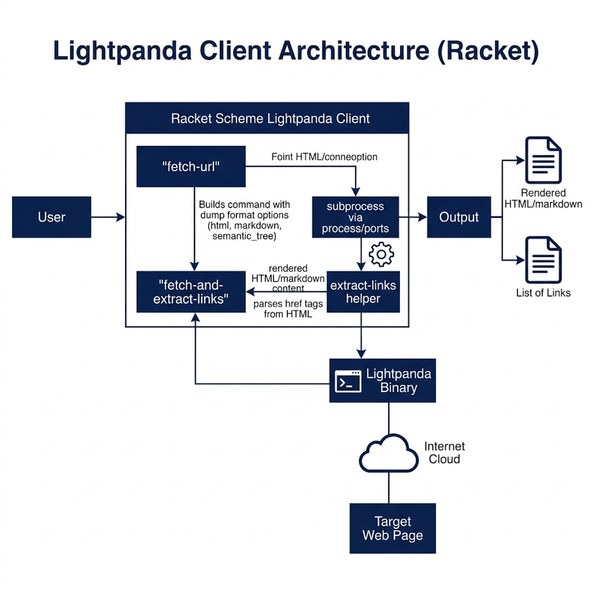

# Interfacing with External Programs: A Lightpanda Browser Client

In this chapter, we build a complete Racket library that interfaces with an external program: the Lightpanda headless web browser. This example demonstrates practical techniques for subprocess management, string processing, and building reusable APIs in Racket. Directions for installing the Lightpanda command line tool can be found in the [Lightpanda documentation](https://lightpanda.io/docs/open-source/installation).

## The Problem: JavaScript-Rendered Web Content

Modern web pages often require JavaScript execution to display their content. Traditional HTTP clients like `net/http-easy` (used in the Web Scraping chapter) only fetch static HTML, missing the dynamic content rendered by JavaScript. Lightpanda is a headless browser that runs from the command line and outputs fully rendered pages.

Our goal: create a Racket interface that:
1. Invokes Lightpanda as a subprocess
2. Captures its output (HTML, Markdown, or semantic tree)
3. Provides helper functions for common operations like link extraction

## Project Structure

The source code for this chapter is in the directory **Racket-AI-book/source-code/lightpanda**. The project layout follows the standard Racket package convention:

```
lightpanda/
  lightpanda.rkt   — Core implementation
  main.rkt         — Package entry point (re-exports public API)
  README.md        — Usage documentation
```

The **main.rkt** file re-exports the public API from **lightpanda.rkt**, making the library installable as a Racket package with `raco pkg install --scope user`:

```racket
#lang racket/base

(require "lightpanda.rkt")

(provide fetch-url
         fetch-and-extract-links
         demo-fetch
         lightpanda-binary)
```

## Configuration

You must have the `lightpanda` tool installed; here I verify the installation on my laptop:

```
$ which lightpanda
/usr/local/bin/lightpanda
```

We use a Racket **parameter** for configurable settings:

```racket
(define lightpanda-binary (make-parameter "lightpanda"))
```

Racket parameters (created with `make-parameter`) are the idiomatic equivalent of Common Lisp's special variables (`defvar` with earmuffs). They provide thread-safe dynamic binding:

```racket
;; Override the binary path for a specific call:
(parameterize ([lightpanda-binary "/usr/local/bin/lightpanda"])
  (fetch-url "https://example.com/"))

;; Or change it globally:
(lightpanda-binary "/usr/local/bin/lightpanda")
```

## Running External Programs with `subprocess`

Racket provides `subprocess` in `racket/system` for launching external processes. Our internal helper wraps this with error handling:

```racket
(define (run-command cmd)
  "Run a shell command string, return stdout as a string (or #f on error)."
  (with-handlers ([exn:fail?
                   (lambda (e)
                     (eprintf "Command error: ~a\nCommand: ~a\n"
                              (exn-message e) cmd)
                     #f)])
    (define-values (proc stdout stdin stderr)
      (subprocess #f #f #f "/bin/sh" "-c" cmd))
    (close-output-port stdin)
    (define output (port->string stdout))
    (close-input-port stdout)
    (close-input-port stderr)
    (subprocess-wait proc)
    (if (zero? (subprocess-status proc))
        output
        (begin
          (eprintf "Command exited with status ~a: ~a\n"
                   (subprocess-status proc) cmd)
          #f))))
```

Key Racket features used:
- `subprocess` — Creates a new process with three ports (stdout, stdin, stderr) plus the process handle
- `define-values` — Destructures the four return values in one binding
- `port->string` — Reads the entire stdout port into a string
- `with-handlers` — Catches exceptions gracefully, returning `#f` on failure
- `subprocess-wait` / `subprocess-status` — Waits for completion and checks the exit code

Note: We pass `#f` for all three port arguments to `subprocess`, which creates new pipes. The command is run through `/bin/sh -c` so we get shell expansion and PATH lookup.

## String Processing: Extracting Links

For link extraction, we scan HTML using Racket's `regexp-match-positions` for efficient pattern matching:

```racket
(define (extract-links html)
  "Return a list of href strings found in <a> tags within an HTML string."
  (define marker "href=\"")
  (define marker-len (string-length marker))
  (let loop ([pos 0] [links '()])
    (define found (regexp-match-positions (regexp-quote marker) html pos))
    (cond
      [(not found) (reverse links)]
      [else
       (define start (cdr (car found)))
       (define end-pos
         (let ([idx (string-index-of html "\"" start)])
           (if idx idx #f)))
       (if end-pos
           (loop (add1 end-pos)
                 (cons (substring html start end-pos) links))
           (loop (add1 start) links))])))
```

Walkthrough:
1. `regexp-match-positions` finds `"href=\""` starting from position `pos`, returning position pairs
2. `substring` extracts the href value between quotes
3. `cons` accumulates links (building a list in reverse)
4. `reverse` produces the final list in correct order
5. The named `let loop` is Racket's idiomatic tail-recursive loop pattern

We also use a small helper for finding character positions:

```racket
(define (string-index-of str char-str start)
  "Find the first occurrence of char-str in str starting from start."
  (define found (regexp-match-positions (regexp-quote char-str) str start))
  (if found (car (car found)) #f))
```

The following diagram shows the high-level architecture of the Lightpanda browser client developed in this chapter:

{width: "100%"}


## The Main API Function

The central function combines everything:

```racket
(define (fetch-url url
                   #:log-level [log-level "warn"]
                   #:obey-robots [obey-robots #f]
                   #:dump [dump "html"])
  "Fetch URL using `lightpanda fetch`, returning the JS-rendered content string.
DUMP controls what is written to stdout; valid values are:
  \"html\"               - full rendered HTML (default)
  \"markdown\"           - page as Markdown
  \"semantic_tree\"      - semantic tree
  \"semantic_tree_text\" - semantic tree as plain text
No server process is required; lightpanda is invoked directly.

  (fetch-url \"https://markwatson.com/\")
  (fetch-url \"https://markwatson.com/\" #:dump \"markdown\")
"
  (define parts
    (append
     (list (lightpanda-binary) "fetch")
     (if obey-robots '("--obey_robots") '())
     (list "--dump" dump
           "--log_level" log-level
           "--log_format" "pretty")
     (list url)))
  (define cmd (string-join parts " "))
  (run-command cmd))
```

Key techniques:
- `#:keyword [param default]` — Racket's keyword arguments with default values (analogous to Common Lisp's `&key`)
- `(if obey-robots '("--obey_robots") '())` — Conditional list inclusion: returns a singleton list or empty
- `string-join` — Combines the argument list into a space-separated command string
- `(lightpanda-binary)` — Calls the parameter to retrieve the current value

### Comparison with Common Lisp

| Concept | Common Lisp | Racket |
|---------|------------|--------|
| Keyword args | `&key (dump "html")` | `#:dump [dump "html"]` |
| Dynamic config | `defvar *lightpanda-binary*` | `(make-parameter "lightpanda")` |
| Subprocess | `uiop:run-program` | `subprocess` |
| String join | `(format nil "~{~a~^ ~}" args)` | `(string-join parts " ")` |
| Error handling | `handler-case` | `with-handlers` |
| Private functions | `%run` prefix convention | Not exported from `provide` |

## Helper Functions

Higher-level helpers make common operations easy:

```racket
(define (fetch-and-extract-links url)
  "Fetch URL with lightpanda and return a list of href link strings.

  (fetch-and-extract-links \"https://markwatson.com/\")
"
  (define html (fetch-url url))
  (if html
      (extract-links html)
      (begin
        (eprintf "Failed to fetch ~a\n" url)
        '())))

(define (demo-fetch url)
  "Fetch URL, print a snippet of HTML and the discovered links.

  (demo-fetch \"https://markwatson.com/\")
"
  (printf "\n=== Fetch demo: ~a ===\n" url)
  (define html (fetch-url url))
  (if html
      (let ([links (extract-links html)])
        (printf "Received ~a bytes of HTML.\n" (string-length html))
        (printf "First 500 chars:\n~a\n\n"
                (substring html 0 (min 500 (string-length html))))
        (printf "Found ~a link(s):\n" (length links))
        (for ([l (in-list links)])
          (printf "  ~a\n" l)))
      (printf "No HTML returned.\n")))
```

Note that `extract-links` is *not* listed in `provide` — Racket's module system makes it private by default. This is cleaner than the Common Lisp `%`-prefix convention: in Racket, privacy is enforced by the language rather than by naming convention.

## Usage Examples

After installing with `raco pkg install --scope user` (from the source directory), or by running the file directly:

```racket
(require lightpanda)

;; Basic HTML fetch
(fetch-url "https://markwatson.com/")

;; Get Markdown output (good for LLM input)
(fetch-url "https://markwatson.com/" #:dump "markdown")

;; Respect robots.txt
(fetch-url "https://markwatson.com/" #:obey-robots #t)

;; Extract all links
(fetch-and-extract-links "https://markwatson.com/")

;; Interactive demo
(demo-fetch "https://markwatson.com/")
```

You can also run the demo directly from the command line:

```
$ racket lightpanda.rkt

=== Fetch demo: https://markwatson.com/ ===
Received 12847 bytes of HTML.
First 500 chars:
<!DOCTYPE html><html lang="en-us">  <head> ...

Found 14 link(s):
  /index.css
  https://mark-watson.blogspot.com
  ...
```

## Key Racket Takeaways

1. **`subprocess`** — Portable subprocess execution; returns four values (process, stdout, stdin, stderr)
2. **`make-parameter`** — Thread-safe dynamic configuration with `parameterize` for scoped overrides
3. **`provide` / module system** — Privacy is enforced by what you export, not by naming conventions
4. **Keyword arguments** — `#:key [param default]` for flexible, self-documenting APIs
5. **Named `let`** — Tail-recursive loops without mutation: `(let loop ([acc '()] ...) ...)`
6. **`with-handlers`** — Structured exception handling with predicate-based dispatch

This pattern — shelling out to a specialized tool and processing its output — is a powerful technique. You can wrap any command-line tool this way: databases, image processors, compilers, or your own scripts. The result is a Racket API that hides the implementation details while providing access to the tool's capabilities.
