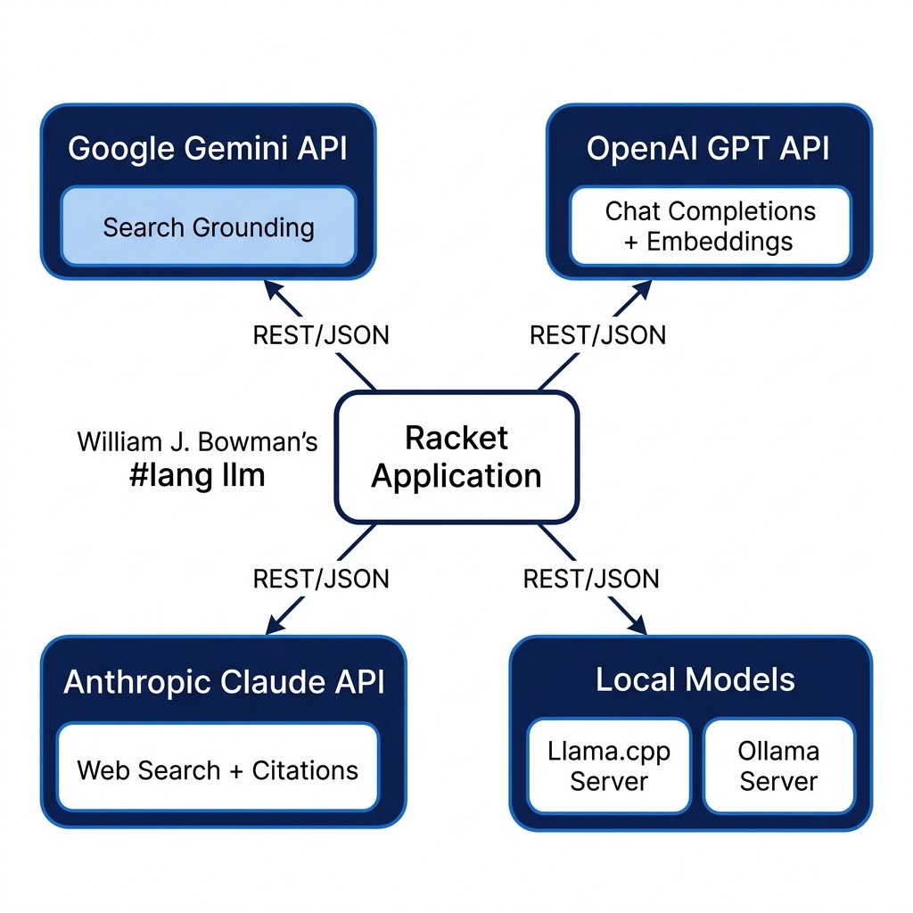

# Using the Google Gemini, OpenAI, Anthropic, Mistral, and Local Large Language Model APIs in Racket

Large Language Models (LLMs) have supercharged AI capabilities, affected the job market for many *knowledge work* careers, and placed huge demands on electrical power infrastructure.

In the development of practical AI systems, LLMs like those provided by OpenAI, Google, Anthropic, Mistral, and Hugging Face have emerged as pivotal tools for numerous applications including natural language processing, generation, and understanding. These models, powered by deep learning architectures, encapsulate a wealth of knowledge and computational capabilities. As a Racket Scheme enthusiast embarking on the journey of intertwining the elegance of Racket with the power of these modern language models, you are opening a gateway to a realm of possibilities that we begin to explore here after covering background material in the next session.

## The Cambrian Explosion in Language Technology: A Historical Trajectory

The sudden and widespread emergence of LLMs in the early 2020s represents a watershed moment in the history of computing, a technological inflection point with profound implications for science, industry, and society.

Yet, this apparent revolution was not a singular event but the culmination of a multi-decade research trajectory.

After using simpler neural networks in the 1980s (I personally used neural models in engineering projects such as a classifier for a bomb detector my company designed and built for the FAA), the next major evolution in language modeling was precipitated by the deep learning revolution that swept through computer vision around 2012. The success of deep neural networks in image classification inspired researchers to adapt these architectures for language tasks. A pivotal innovation from this period was the development of word embeddings, most famously Word2Vec by Tomas Mikolov at Google in 2013. Instead of treating words as discrete symbols, word embeddings represent them as dense vectors in a continuous, high-dimensional semantic space. In this space, geometric relationships between vectors correspond to semantic relationships between words, enabling algebraic operations like the canonical example:

```$
\mathrm{vec}(\text{King}) - \mathrm{vec}(\text{Man}) + \mathrm{vec}(\text{Woman}) \approx \mathrm{vec}(\text{Queen}).
```

This was a crucial step towards models that could capture the meaning and relationships of words, rather than just their statistical co-occurrence (i.e., which words often appear together in text). Much of my paid work in the 1980s involved applications of neural networks but I mostly moved on to other technologies until the deep learning revolution in 2012 and after personal experiments with word embeddings and later sentence and paragraph embeddings I went all-in on deep learning leading to managing a deep learning team at Capital One.
 
To process sequences of these word vectors, we turned to Recurrent Neural Networks (RNNs). An RNN processes a sequence one element at a time, maintaining an internal "hidden state" that acts as a memory, theoretically allowing information from earlier in the sequence to influence the processing of later elements. This architecture seemed a natural fit for language. However, in practice, standard RNNs were plagued by the vanishing gradient problem and inability to handle long sequences or characters in text, effectively preventing the model from learning dependencies between words that were far apart. A key breakthrough that temporarily surmounted this challenge was the Long Short-Term Memory (LSTM) network.
 
**The Transformer Inflection Point: "Attention Is All You Need"**

Despite the success of LSTMs, a fundamental architectural bottleneck remained. Both RNNs and LSTMs are inherently sequential processors; they must compute the hidden state for token `t`$ before they can compute it for token `t+1`$. This sequential dependency made it impossible to fully parallelize the computation across the tokens in a sequence, creating a significant performance barrier on modern hardware like GPUs. solution arrived in 2017 with a landmark paper from researchers at Google titled "Attention Is All You Need". The paper introduced the Transformer architecture, which dispensed with recurrence entirely and relied instead on a mechanism called "self-attention." The attention mechanism, first developed by Bahdanau et al. in 2014 for machine translation, allows a model to dynamically weigh the importance of different parts of the input sequence when producing an output.

## Commercial and Open Weight LLMs

The commercial APIs from OpenAI, Google, Anthropic, and Mistral serve as gateways to some of the most advanced language models available today. By accessing these APIs, developers can harness the power of these models for a variety of applications.

OpenAI provides an API for developers to access models like GPT-5. The OpenAI API provides endpoints for different types of interactions, be it text completion, translation, or semantic search among others.

Google Gemini provides fast and capable models such as `gemini-flash-latest` and `gemini-2.5-flash-lite`, accessible through both Google's native API (with Google Search grounding) and an OpenAI-compatible endpoint.

Anthropic focuses on building steerable and interpretable models like the Claude family (e.g. `claude-sonnet-4-6`), offering native tool use and search capabilities through its Messages API.

Mistral AI provides efficient open-weight and hosted models such as `mistral-small` and `mistral-embed`.

What if you want the total control of running open LLMs on your own computers? The company [Hugging Face](https://huggingface.co) maintains a huge repository of pre-trained models. Some of these models are licensed for research only but many are licensed (e.g., using Apache 2) for commercial use. You can easily run models locally on your laptop using tools like [llama.cpp](https://github.com/ggerganov/llama.cpp) or [Ollama](https://ollama.ai).

## Introduction to the Applications of LLMs

The utility of LLMs extends across a broad spectrum of applications including text generation, translation, summarization, question answering, semantic search, and autonomous agents with tool calling. However, with great power comes great responsibility. The deployment of LLMs raises imperative considerations regarding ethics, bias, and the potential for misuse. Moreover, the black-box nature of these models presents challenges in interpretability and control, which are active areas of research. I recommend reading material at [Center for Humane Technology](https://www.humanetech.com/key-issues) for issues of the safe use of AI. You might also be interested in my book [Safe For Humans AI: A "humans-first" approach to designing and building AI systems](https://leanpub.com/safe-for-humans-AI/read) (free to read online).

---

## A Uniform API for LLMs in Racket: `llmapis.rkt`

In early experiments with LLM APIs, developers typically wrote custom HTTP clients for each provider: one function for OpenAI, another for Anthropic, another for Google Gemini, and separate routines for local Ollama or llama.cpp instances. Each provider exposed slightly different endpoint paths, authentication headers, request payloads, parameter names (`max_tokens` vs `max_completion_tokens`), and JSON schemas for tool calling.

Switching an application from OpenAI to Gemini or to a local model required changing function names, restructuring request payloads, and rewriting error handling. Furthermore, manipulating JSON strings manually in Scheme code is tedious and error-prone.

To eliminate this friction, the `source-code/llmapis/` directory contains a **uniform API** in `llmapis.rkt`. Modeled on the Common Lisp `litelm` library, `llmapis.rkt` establishes a single, idiomatic Racket entry point for all LLM providers:

- **Uniform Addressing:** Models are addressed with a `"provider/model-name"` string (for example `"openai/gpt-5-mini"`, `"gemini/gemini-flash-latest"`, `"ollama/qwen3:1.7b"`, `"mistral/mistral-small"`, `"deepseek/deepseek-chat"`, or `"anthropic/claude-sonnet-4-6"`).
- **No JSON in User Code:** Messages, options, and tool definitions use Racket lists, keywords, and transparent structs. The uniform API handles all wire-format translation behind the scenes.
- **Racket Functions as Tools:** Tools are ordinary Racket functions taking an argument hash. You wrap them with `make-llm-tool`, pass them to the model, and the library translates them to the provider's tool schema.
- **Automated Agentic Loop:** `llm-chat-with-tools` runs the complete request/execute/reply conversation loop automatically until the model produces a final text response.
- **Pluggable Providers:** Standard providers are pre-configured, and new OpenAI-compatible providers (such as Groq, Together AI, or OpenRouter) can be registered at runtime with `define-provider`.
- **Structured Error Hierarchy:** HTTP failures map to an exception hierarchy (`exn:fail:llm:authentication`, `exn:fail:llm:rate-limit`, `exn:fail:llm:not-found`, `exn:fail:llm:context-window`, `exn:fail:llm:api`), complete with automatic parameter fallbacks (e.g. retrying with `max_completion_tokens` on newer OpenAI models).

### Quick Start with the Uniform API

Using `llmapis.rkt` is straightforward. Here are common patterns:

```racket
#lang racket

(require "llmapis.rkt")

;; 1. One-shot question answering (returns a plain string)
(displayln (llm-ask "openai/gpt-5-mini" "What is the capital of France?"))
(displayln (llm-ask "gemini/gemini-flash-latest" "What is 2 + 2?"))

;; Local models require no API keys:
(displayln (llm-ask "ollama/qwen3:1.7b" "What is recursion in Scheme?"))
(displayln (llm-ask "llama-local/local-model" "What is 2 + 2?"))

;; 2. Full chat completion (returns an llm-response struct)
(define resp
  (llm-completion "openai/gpt-5-mini"
                  #:messages '(("system" "You are a concise programming tutor.")
                               ("user" "Explain tail recursion in two sentences."))))

(printf "Answer: ~a\n" (llm-response-content resp))
(printf "Tokens: ~a\n" (llm-response-usage resp))

;; 3. Vector embeddings across providers
(define emb
  (llm-embedding "openai/text-embedding-ada-002" "Practical Artificial Intelligence"))
(printf "Embedding dimension: ~a\n" (length (first emb)))

;; 4. Tools as first-class Racket functions
(define (get-weather args)
  (format "sunny and 22C in ~a" (hash-ref args 'location "nowhere")))

(define weather-tool
  (make-llm-tool "get_weather"
                 "Get the current weather for a location"
                 '(("location" "string" "City name, e.g. Paris"))
                 get-weather))

;; Automated request/execute/reply tool loop:
(define agent-resp
  (llm-chat-with-tools "openai/gpt-5-mini"
                       "What is the weather in Paris?"
                       (list weather-tool)))

(displayln (llm-response-content agent-resp))

;; 5. Dynamically register any OpenAI-compatible provider at runtime
(define-provider 'groq "https://api.groq.com/openai/v1"
  #:env-keys '("GROQ_API_KEY"))
```

### Model Routing and Provider Registry

The model string prefix routes each request to its provider. The provider table maintains base URLs, authentication environment variables, and the transport kind:

| Provider | Model Prefix | Environment Variable(s) | Base URL | Kind |
|---|---|---|---|---|
| OpenAI | `openai/` | `OPENAI_API_KEY`, `OPENAI_KEY` | `https://api.openai.com/v1` | `openai-compatible` |
| Google Gemini | `gemini/` | `GEMINI_API_KEY`, `GOOGLE_API_KEY` | `https://generativelanguage.googleapis.com/v1beta/openai` | `openai-compatible` |
| Mistral AI | `mistral/` | `MISTRAL_API_KEY` | `https://api.mistral.ai/v1` | `openai-compatible` |
| DeepSeek | `deepseek/` | `DEEPSEEK_API_KEY` | `https://api.deepseek.com/v1` | `openai-compatible` |
| Fireworks AI | `fireworks-ai/` | `FIREWORKS_API_KEY` | `https://api.fireworks.ai/inference/v1` | `openai-compatible` |
| Ollama (local) | `ollama/` | *(none needed)* | `http://localhost:11434/v1` | `openai-compatible` |
| Anthropic | `anthropic/` | `ANTHROPIC_API_KEY` | `https://api.anthropic.com/v1` | `anthropic` |
| llama.cpp (local) | `llama-local/` | *(none needed)* | `http://localhost:8080` | `llama-cpp` |

Notice that Google Gemini is reached via its OpenAI-compatible endpoint (`/v1beta/openai`), and Ollama is reached via its OpenAI-compatible `/v1` endpoint. This allows six different cloud and local backends to share a single, battle-tested transport path. Anthropic uses its native Messages API adapter, and local `llama.cpp` uses its native `/completion` endpoint.

Model names can contain slashes (for example, `"fireworks-ai/accounts/fireworks/models/deepseek-v3"`). The routing parser splits on the first slash:

```racket
(define (parse-model model #:provider [provider #f])
  (cond [provider
         (values (find-provider provider) model)]
        [(and (string? model)
              (regexp-match #rx"^([^/]+)/(.+)$" model))
         => (lambda (m)
              (values (find-provider (string->symbol (cadr m)))
                      (caddr m)))]
        [else
         (llm-error "Model ~s must be of the form \"provider/model-name\"" model)]))
```

You can also pass `#:api-key` or `#:api-base` to any uniform API call to override defaults per invocation.

### Messages and Roles

Messages are represented as transparent `llm-message` structs:

```racket
(struct llm-message (role content tool-calls tool-call-id name) #:transparent)
```

The uniform API accepts multiple convenient representations and normalizes them with `normalize-messages`:

- A plain string: `"What is 2+2?"` is treated as a user message.
- A 2-element list: `'(system "You are a helpful assistant")` or `'("user" "Hello")`.
- Keyword options: `'(assistant #f #:tool-calls (...))` or `'(tool "Result text" #:tool-call-id "call_123")`.
- Helper constructors: `llm-user-message`, `llm-system-message`, `llm-assistant-message`, and `llm-tool-message`.

When targeting OpenAI-compatible providers, `llm-translate-messages` formats messages as JSON objects. When targeting Anthropic, `llm-translate-messages-anthropic` extracts top-level system prompts and converts assistant tool calls and user tool results into Anthropic content blocks (`tool_use` and `tool_result`), merging consecutive same-role messages as required by the Anthropic API.

### First-Class Racket Tools

Tools in `llmapis.rkt` are defined directly as Racket functions that accept a single hash table of arguments (with symbol keys) and return a value:

```racket
(struct llm-param (name type description required? enum) #:transparent)
(struct llm-tool (name description parameters proc) #:transparent)

(define (make-llm-tool name description params proc)
  (define n (if (symbol? name) (symbol->string name) name))
  (llm-tool n description (map parse-param-spec params) proc))
```

Each parameter in `params` is specified as:

```racket
(list param-name type-string description-string [#:required bool] [#:enum list])
```

Parameters are required by default. For example:

```racket
(define (add-numbers args)
  (+ (hash-ref args 'a 0) (hash-ref args 'b 0)))

(define add-tool
  (make-llm-tool "add_numbers"
                 "Add two numbers together"
                 '((a "number" "First addend")
                   (b "number" "Second addend"))
                 add-numbers))
```

From this definition, `llm-translate-tools` generates standard JSON Schema objects for OpenAI-compatible endpoints, and `llm-translate-tools-anthropic` generates Anthropic tool schemas.

When the model decides to invoke a tool, `llm-completion` returns an `llm-response` containing a list of `llm-tool-call` structs. The tool calls can then be safely dispatched using `execute-tool-calls`:

```racket
(define (execute-tool-calls tools tool-calls)
  (define registry
    (if (hash? tools)
        tools
        (for/hash ([t (in-list (normalize-tools tools))])
          (values (llm-tool-name t) t))))
  (for/list ([call (in-list tool-calls)])
    (define id (llm-tool-call-id call))
    (define name (llm-tool-call-name call))
    (define tool (hash-ref registry name #f))
    (define args (llm-tool-call-arguments call))
    (define result
      (cond [(not tool)
             (format "Error: unknown tool: ~a" name)]
            [(and (llm-tool-call-arguments-raw call)
                  (not (hash? (string->jsexpr-safe
                               (llm-tool-call-arguments-raw call)))))
             (format "Error: invalid JSON arguments for tool '~a'. Received: ~a"
                     name (llm-tool-call-arguments-raw call))]
            [else
             (define missing
               (for/list ([p (in-list (llm-tool-parameters tool))]
                          #:when (and (llm-param-required? p)
                                      (not (hash-has-key?
                                            args
                                            (string->symbol
                                             (llm-param-name p))))))
                 (llm-param-name p)))
             (cond [(pair? missing)
                     (format "Error: tool '~a' missing required argument(s): ~a"
                             name (string-join missing ", "))]
                   [else
                    (with-handlers
                        ([exn:fail?
                          (lambda (e)
                            (format "Error: tool '~a' raised: ~a"
                                    name (exn-message e)))])
                      (define v ((llm-tool-proc tool) args))
                      (cond [(void? v) ""]
                            [(string? v) v]
                            [else (format "~a" v)]))])]))
    (llm-tool-result id name result)))
```

Notice the defensive design: if the model calls an unknown tool, omits a required argument, passes invalid JSON, or the Racket tool handler throws an exception, `execute-tool-calls` converts the failure into an `"Error: ..."` feedback string for the model rather than raising an unhandled exception in your program. The model can then inspect the error message and correct its call on the next turn.

### The Agentic Tool Loop

The function `llm-chat-with-tools` orchestrates the complete interaction loop between the model and Racket tools:

```racket
(define (llm-chat-with-tools model messages tools
                             #:max-iterations [max-iterations 10]
                             #:tool-choice [tool-choice 'auto]
                             #:temperature [temperature #f]
                             #:max-tokens [max-tokens #f]
                             #:top-p [top-p #f]
                             #:system [system #f]
                             #:provider [provider #f]
                             #:api-key [api-key #f]
                             #:api-base [api-base #f])
  (let loop ([msgs (normalize-messages messages)]
             [fuel max-iterations])
    (define resp
      (llm-completion model
                      #:messages msgs
                      #:tools tools
                      #:tool-choice tool-choice
                      #:temperature temperature
                      #:max-tokens max-tokens
                      #:top-p top-p
                      #:system system
                      #:provider provider
                      #:api-key api-key
                      #:api-base api-base))
    (define calls (llm-response-tool-calls resp))
    (if (or (null? calls) (<= fuel 1))
        resp
        (let ([results (execute-tool-calls tools calls)])
          (loop (append msgs
                        (cons (llm-assistant-message resp)
                              (map llm-tool-message results)))
                (sub1 fuel))))))
```

If you prefer manual control (for instance, to log intermediate turns or ask the user for approval before running a destructive tool), you can perform each step yourself using `llm-completion`, `execute-tool-calls`, `llm-assistant-message`, and `llm-tool-message`:

```racket
;; Step 1: Initial call with available tools
(define step1
  (llm-completion "openai/gpt-5-mini"
                  #:messages "What is the weather in Paris?"
                  #:tools (list weather-tool)))

;; Step 2: Execute tool calls requested by the model
(define results (execute-tool-calls (list weather-tool)
                                   (llm-response-tool-calls step1)))

;; Step 3: Feed assistant call and tool results back for the final answer
(define step2
  (llm-completion "openai/gpt-5-mini"
                  #:messages (list (llm-user-message "What is the weather in Paris?")
                                   (llm-assistant-message step1)
                                   (llm-tool-message (first results)))
                  #:tools (list weather-tool)))

(displayln (llm-response-content step2))
```

### Error Handling Hierarchy and Automatic Fallbacks

Errors are modeled after a clear hierarchy rooted at `exn:fail:llm`:

```
exn:fail:llm
└── exn:fail:llm:api  (fields: status body)
    ├── exn:fail:llm:authentication      (HTTP 401, 403)
    ├── exn:fail:llm:rate-limit          (HTTP 429)
    ├── exn:fail:llm:not-found           (HTTP 404)
    └── exn:fail:llm:context-window      (HTTP 400 mentioning "context")
```

This lets application code handle specific conditions cleanly with Racket's `with-handlers`:

```racket
(with-handlers ([exn:fail:llm:rate-limit?
                 (lambda (e) (displayln "Hit rate limit, backing off..."))]
                [exn:fail:llm:authentication?
                 (lambda (e) (displayln "Invalid API key!"))]
                [exn:fail:llm:api?
                 (lambda (e) (printf "API failed with status ~a\n" (exn:fail:llm:api-status e)))])
  (llm-ask "openai/gpt-5-mini" "Hello"))
```

In addition, newer OpenAI models reject the historical `max_tokens` field with an HTTP 400 error requiring `max_completion_tokens`. `llmapis.rkt` catches this automatically via `openai-max-tokens-fallback?` and transparently retries the request once with `max_completion_tokens`.

---

## Dedicated Provider Modules and Proprietary Features

While `llmapis.rkt` handles general chat completions, function/tool calling, and text embeddings uniformly across all providers, certain cloud providers offer specialized features that fall outside standard chat endpoints.

The `llmapis/` directory therefore preserves dedicated per-provider modules for these specialized extras:

- `gemini.rkt`: Google Gemini with Google Search grounding and URL citation extraction.
- `anthropic.rkt`: Anthropic Claude with native web search beta and citations.
- `openai.rkt`: Direct OpenAI chat and embeddings.
- `mistral.rkt`: Direct Mistral AI chat and embeddings.
- `llama_local.rkt`: Local llama.cpp server client.
- `ollama_ai_local.rkt`: Local Ollama client.
- `main.rkt`: Local package export.

Let us examine these modules.

### Google Gemini with Search Grounding (`gemini.rkt`)

Google's Gemini models support *search grounding*, allowing the model to query Google Search in real time and return authoritative web citations alongside its answer. This is vital when building applications that require up-to-the-minute information rather than static training data.

The module `gemini.rkt` interacts with the native Google Generative Language API endpoint (`models/{model}:generateContent`):

```racket
#lang racket

;;; Copyright (C) 2026 Mark Watson <markw@markwatson.com>
;;; Apache 2 License

(require net/http-easy)
(require json)

(provide generate
         generate-with-search
         generate-with-search-and-citations)

(define *gemini-model* "gemini-flash-latest")
(define *gemini-max-tokens* 8192)

(define *google-api-key*
  (or (getenv "GOOGLE_API_KEY")
      (error "GOOGLE_API_KEY environment variable is not set")))

(define *base-url*
  "https://generativelanguage.googleapis.com/v1beta/models")

(define (auth-proc uri headers params)
  (values
   (hash-set* headers
              'x-goog-api-key *google-api-key*
              'content-type "application/json")
   params))

(define (call-generate-content model data)
  (let ((url (string-append *base-url* "/" model ":generateContent")))
    (response-json
     (post url
           #:auth auth-proc
           #:json data))))

(define (extract-text response)
  "Extract text from a generateContent API response."
  (when (hash-has-key? response 'error)
    (error "Gemini API error" (hash-ref response 'error)))
  (let* ((candidates (hash-ref response 'candidates '()))
         (first-cand (if (null? candidates) (hash) (car candidates)))
         (content (hash-ref first-cand 'content (hash)))
         (parts (hash-ref content 'parts '()))
         (first-part (if (null? parts) (hash) (car parts))))
    (hash-ref first-part 'text "No response")))

(define (generate prompt [model *gemini-model*])
  (let* ((data (hash 'contents
                     (list (hash 'parts
                                  (list (hash 'text prompt))))))
         (r (call-generate-content model data)))
    (extract-text r)))

(define (generate-with-search prompt [model *gemini-model*])
  (let* ((data (hash 'contents
                     (list (hash 'parts
                                  (list (hash 'text prompt))))
                     'tools (list (hash 'googleSearch (hash)))))
         (r (call-generate-content model data)))
    (extract-text r)))

(define (generate-with-search-and-citations prompt [model *gemini-model*])
  (let* ((data (hash 'contents
                     (list (hash 'parts
                                  (list (hash 'text prompt))))
                     'tools (list (hash 'googleSearch (hash)))))
         (r (call-generate-content model data))
         (text (extract-text r))
         (candidates (hash-ref r 'candidates '()))
         (first-cand (if (null? candidates) (hash) (car candidates)))
         (grounding (hash-ref first-cand 'groundingMetadata (hash)))
         (grounding-chunks (hash-ref grounding 'groundingChunks '()))
         (citations
          (for/list ([chunk grounding-chunks])
            (let ((web (hash-ref chunk 'web (hash))))
              (cons (hash-ref web 'title "")
                    (hash-ref web 'uri ""))))))
    (values text citations)))
```

In `generate-with-search-and-citations`, we supply `'tools (list (hash 'googleSearch (hash)))`. Gemini executes web queries and includes a `groundingMetadata` structure containing `groundingChunks`. The function returns both the generated markdown text and a list of `(title . url)` pairs:

```racket
> (require "gemini.rkt")
> (let-values ([(text citations) (generate-with-search-and-citations "Latest AI news")])
    (displayln text)
    (displayln citations))
Here is a summary of the latest AI developments...
(("TechCrunch: AI models update" . "https://techcrunch.com/...")
 ("Arxiv: Attention mechanisms" . "https://arxiv.org/..."))
```

### Anthropic Claude with Web Search (`anthropic.rkt`)

Anthropic provides the Messages API at `https://api.anthropic.com/v1/messages`. In addition to standard generation, `anthropic.rkt` demonstrates Anthropic's web search capability:

```racket
#lang racket

;;; Copyright (C) 2026 Mark Watson <markw@markwatson.com>
;;; Apache 2 License

(require net/http-easy)
(require json)

(provide generate
         question-anthropic-with-search
         question-anthropic-with-search-and-citations)

(define *claude-endpoint* "https://api.anthropic.com/v1/messages")
(define *claude-model* "claude-sonnet-4-6")
(define *claude-max-tokens* 1000)

(define (make-auth-proc [extra-headers '()])
  (lambda (uri headers params)
    (values
     (apply hash-set* headers
            (append (list 'x-api-key (getenv "ANTHROPIC_API_KEY")
                          'anthropic-version "2023-06-01"
                          'content-type "application/json")
                    extra-headers))
     params)))

(define (call-claude data [extra-headers '()])
  (response-json
   (post *claude-endpoint*
         #:auth (make-auth-proc extra-headers)
         #:json data)))

(define (generate prompt max-tokens)
  (let* ((data (hash 'model *claude-model*
                     'max_tokens max-tokens
                     'messages (list (hash 'role "user" 'content prompt))))
         (r (call-claude data))
         (content (hash-ref r 'content '()))
         (first-block (if (null? content) (hash) (car content))))
    (hash-ref first-block 'text "No response")))

(define (question-anthropic-with-search prompt)
  (let* ((data (hash 'model *claude-model*
                     'max_tokens *claude-max-tokens*
                     'messages (list (hash 'role "user" 'content prompt))
                     'tools (list (hash 'type "web_search_20250305" 'name "web_search"))))
         (r (call-claude data (list 'anthropic-beta "web-search-2025-03-05")))
         (content (hash-ref r 'content '()))
         (text-blocks (filter (lambda (b) (equal? (hash-ref b 'type "") "text")) content))
         (last-block (and (pair? text-blocks) (last text-blocks))))
    (if last-block
        (hash-ref last-block 'text "No response content")
        "No response content")))

(define (question-anthropic-with-search-and-citations prompt)
  (let* ((data (hash 'model *claude-model*
                     'max_tokens *claude-max-tokens*
                     'messages (list (hash 'role "user" 'content prompt))
                     'tools (list (hash 'type "web_search_20250305" 'name "web_search"))))
         (r (call-claude data (list 'anthropic-beta "web-search-2025-03-05")))
         (content (hash-ref r 'content '()))
         (text-blocks (filter (lambda (b) (equal? (hash-ref b 'type "") "text")) content))
         (last-block (and (pair? text-blocks) (last text-blocks)))
         (text (if last-block (hash-ref last-block 'text "No response content") "No response content"))
         (result-blocks (filter (lambda (b) (equal? (hash-ref b 'type "") "web_search_tool_result")) content))
         (citations (for*/list ([block result-blocks]
                                [result (hash-ref block 'content '())]
                                #:when (equal? (hash-ref result 'type "") "web_search_result"))
                      (cons (hash-ref result 'title "") (hash-ref result 'url "")))))
    (values text citations)))
```

Testing Anthropic in the Racket REPL:

```racket
> (require "anthropic.rkt")
> (generate "What is the capital of France?" 50)
"The capital of France is Paris."
```

### Direct OpenAI API (`openai.rkt`)

For developers wishing to inspect the raw wire communication with OpenAI, `openai.rkt` demonstrates direct POST requests using `net/http-easy`:

```racket
#lang racket

(require net/http-easy)
(require racket/set)
(require racket/pretty)

(provide question-openai completion-openai embeddings-openai)

(define (helper-openai prefix prompt)
  (let* ((prompt-data
          (string-join
           (list
            (string-append
             "{\"messages\": [ {\"role\": \"user\","
             " \"content\": \"" prefix ": "
             prompt
             "\"}], \"model\": \"gpt-5-mini\"}"))))
         (auth (lambda (uri headers params)
                 (values
                  (hash-set*
                   headers
                   'authorization
                   (string-join
                    (list
                     "Bearer "
                     (getenv "OPENAI_API_KEY")))
                   'content-type "application/json")
                  params)))
         (p
          (post
           "https://api.openai.com/v1/chat/completions"
           #:auth auth
           #:data prompt-data))
         (r (response-json p)))
    (hash-ref
     (hash-ref (first (hash-ref r 'choices)) 'message)
     'content)))

(define (question-openai prompt)
  (helper-openai "Answer the question: " prompt))

(define (completion-openai prompt)
  (helper-openai "Continue writing from the following text: " prompt))

(define (embeddings-openai text)
  (let* ((prompt-data
          (string-join
           (list
            (string-append
             "{\"input\": \"" text "\","
             " \"model\": \"text-embedding-ada-002\"}"))))
         (auth (lambda (uri headers params)
                 (values
                  (hash-set*
                   headers
                   'authorization
                   (string-join
                    (list
                     "Bearer "
                     (getenv "OPENAI_API_KEY")))
                   'content-type "application/json")
                  params)))
         (p
          (post
           "https://api.openai.com/v1/embeddings"
           #:auth auth
           #:data prompt-data))
         (r (response-json p)))
    (hash-ref
     (first (hash-ref r 'data))
     'embedding)))
```

### Direct Mistral AI API (`mistral.rkt`)

Mistral provides hosted European models via an OpenAI-compatible API at `https://api.mistral.ai/v1`:

```racket
#lang racket

(require net/http-easy)
(require racket/set)

(provide question-mistral completion-mistral embeddings-mistral)

(define (question-mistral prompt)
  (let* ((prompt-data
          (string-join
           (list
            (string-append
             "{\"messages\": [ {\"role\": \"user\","
             " \"content\": \"Answer the question: "
             prompt
             "\"}], \"model\": \"mistral-small\"}"))))
         (auth (lambda (uri headers params)
                 (values
                  (hash-set*
                   headers
                   'authorization
                   (string-join
                    (list
                     "Bearer "
                     (getenv "MISTRAL_API_KEY")))
                   'content-type "application/json")
                  params)))
         (p
          (post
           "https://api.mistral.ai/v1/chat/completions"
           #:auth auth
           #:data prompt-data))
         (r (response-json p)))
    (hash-ref
     (hash-ref (first (hash-ref r 'choices)) 'message)
     'content)))

(define (completion-mistral prompt)
  (question-mistral
   (string-append "Continue writing from the following text: " prompt)))

(define (embeddings-mistral text)
  (let* ((prompt-data
          (string-join
           (list
            (string-append
             "{\"input\": [\"" text "\"],"
             " \"model\": \"mistral-embed\"}"))))
         (auth (lambda (uri headers params)
                 (values
                  (hash-set*
                   headers
                   'authorization
                   (string-join
                    (list
                     "Bearer "
                     (getenv "MISTRAL_API_KEY")))
                   'content-type "application/json")
                  params)))
         (p
          (post
           "https://api.mistral.ai/v1/embeddings"
           #:auth auth
           #:data prompt-data))
         (r (response-json p)))
    (hash-ref
     (first (hash-ref r 'data))
     'embedding)))
```

### Running Local Models: `llama.cpp` (`llama_local.rkt`)

Running models locally gives you complete privacy, zero API costs, and offline execution. The `llama.cpp` project provides an efficient C++ inference engine that runs quantized GGUF models on CPUs and Apple Silicon GPUs.

To build and run the server:

```bash
git clone https://github.com/ggerganov/llama.cpp.git
cd llama.cpp && make
mkdir models
# Download a GGUF model into models/
./llama-server -m models/your-model.gguf --port 8080 -c 2048
```

The file `llama_local.rkt` interfaces with `llama-server`'s `/completion` endpoint:

```racket
#lang racket

(require net/http-easy)
(require racket/set)

(provide question-llama-local completion-llama-local)

(define (helper prompt)
  (let* ((prompt-data
          (string-join
           (list
            (string-append
             "{\"prompt\": \""
             prompt
             "\", \"n_predict\": 256, \"top_k\": 1}"))))
         (p
          (post
           "http://localhost:8080/completion"
           #:data prompt-data))
         (r (response-json p)))
    (hash-ref r 'content)))

(define (question-llama-local question)
  (helper (string-append "Answer: " question)))

(define (completion-llama-local prompt)
  (helper (string-append "Continue writing from the following text: " prompt)))
```

### Running Local Models: Ollama (`ollama_ai_local.rkt`)

[Ollama](https://ollama.ai) is an easy way to run local open-weight models on macOS, Linux, and Windows. Once installed, pull a model from the terminal:

```bash
ollama run mistral
# or a compact model:
ollama run qwen3:1.7b
```

Ollama automatically starts a background HTTP service on port 11434. The file `ollama_ai_local.rkt` interfaces with Ollama's native `/api/generate` and `/api/embeddings` routes:

```racket
#lang racket

(require net/http-easy)
(require racket/set)

(provide question-ollama-ai-local completion-ollama-ai-local embeddings-ollama)

(define (helper prompt . model-name)
  (let* ((model (if (null? model-name) "mistral" (first (first model-name))))
         (prompt-data
          (string-join
           (list
            (string-append
             "{\"prompt\": \""
             prompt
             "\", \"model\": \"" model "\", \"stream\": false}"))))
         (p
          (post
           "http://localhost:11434/api/generate"
           #:data prompt-data))
         (r (response-json p)))
    (hash-ref r 'response)))

(define (question-ollama-ai-local question . model-name)
  (helper (string-append "Answer: " question) model-name))

(define (completion-ollama-ai-local prompt . model-name)
  (helper (string-append "Continue writing from the following text: " prompt)
          model-name))

(define (embeddings-ollama text)
  (let* ((prompt-data
          (string-join
           (list
            (string-append
             "{\"prompt\": \"" text "\","
             " \"model\": \"mistral\"}"))))
         (p
          (post
           "http://localhost:11434/api/embeddings"
           #:data prompt-data))
         (r (response-json p)))
    (hash-ref r 'embedding)))
```

### The Re-export Module (`main.rkt`)

The file `main.rkt` bundles the legacy provider exports into a single module:

```racket
#lang racket/base

(require "anthropic.rkt")
(require "llama_local.rkt")
(require "ollama_ai_local.rkt")
(require "openai.rkt")

(provide question-anthropic-with-search question-anthropic-with-search-and-citations)
(provide question-llama-local completion-llama-local embeddings-ollama)
(provide question-ollama-ai-local completion-ollama-ai-local)
(provide question-openai completion-openai embeddings-openai)
```

---

## Architecture and File Organization

The `source-code/llmapis/` directory is structured as follows:

| File | Contents |
|---|---|
| `llmapis.rkt` | **Uniform API:** provider routing, message normalization, Racket-function tools, chat completion, embeddings, and agentic loop. |
| `gemini.rkt` | Direct Google Gemini client: Google Search grounding and URL citation extraction via `generateContent`. |
| `anthropic.rkt` | Direct Anthropic client: native Messages API with web search beta and citations. |
| `openai.rkt` | Direct OpenAI client: chat completion and text embeddings. |
| `mistral.rkt` | Direct Mistral AI client: chat completion and text embeddings. |
| `ollama_ai_local.rkt` | Direct Ollama client: local text generation and embeddings. |
| `llama_local.rkt` | Direct llama.cpp client: local text completion. |
| `main.rkt` | Package entry point re-exporting per-provider modules. |
| `test.rkt` | Smoke test and live demonstration of the uniform API. |

The following diagram illustrates the architecture of the uniform API and its provider adapters:

{width: "100%"}


### Installing as a Local Package

You can install `llmapis` as a linked local Racket package so other projects in the book (such as `embeddingsdb`, `RAG`, and `pdf_chat`) can require it directly via `(require llmapis)`:

```bash
cd source-code/llmapis
raco pkg remove llmapis               # if previously installed
raco pkg install --scope user
```

When you edit code in `llmapis/`, compile the updated files in place:

```bash
raco make main.rkt llmapis.rkt
```

---

## Examples Using William J. Bowman’s Racket Language LLM

Since I wrote my initial LLM client libraries, William J. Bowman wrote an interesting new Racket language extension (`#lang llm`) that can be used interactively in DrRacket or imported as a library in standard `#lang racket` programs.

The examples are located in **Racket-AI-book/source-code/racket_llm_language**:

- `test_lang_mode_llm_openai.rkt` - uses `#lang llm`
- `test_llm_openai.rkt` - uses `#lang racket`
- `test_llm_ollama.rkt` - uses `#lang racket`

The documentation for Bowman's LLM language is available at [https://docs.racket-lang.org/llm/index.html](https://docs.racket-lang.org/llm/index.html) and on GitHub at [https://github.com/wilbowma/llm-lang](https://github.com/wilbowma/llm-lang).

### Interactive `#lang llm` Example

In `test_lang_mode_llm_openai.rkt`, Racket expressions are escaped with `@`, and plain text is treated directly as a prompt sent to the LLM:

```racket
#lang llm

@(require llm/openai/gpt4o-mini)

What is 13 + 7?
```

Evaluating this in a DrRacket buffer produces:

```
Welcome to DrRacket, version 8.12 [cs].
Language: llm, with debugging; memory limit: 128 MB.
13 + 7 equals 20.
> What is 66 + 2?
66 + 2 equals 68.
> What is the radius of the moon?
The average radius of the Moon is approximately 1,737.4 kilometers (about 1,079.6 miles).
> 
```

### Using the LLM Language as a Library

To use Bowman's package as a library inside standard `#lang racket` programs, install the package:

```bash
raco pkg install llm
```

Here is `test_llm_openai.rkt`:

```racket
#lang racket

(require llm/openai/gpt4o-mini)

(gpt4o-mini-send-prompt! "What is 13 + 7?" '())
```

And for a local model running on Ollama, here is `test_llm_ollama.rkt`:

```racket
#lang racket

(require llm/ollama/phi3)

(phi3-send-prompt! "What is 13 + 7? Be concise." '())
```

Output:

```
Welcome to DrRacket, version 8.12 [cs].
Language: racket, with debugging; memory limit: 128 MB.
"20."
> (phi3-send-prompt! "Mary is 37 years old, Bill is 28, and Sam is 52. List the pairwise age differences. Be concise." '())
"- Mary vs Bill: 9 years (37 - 28)\n\n- Mary vs Sam: 15 years (37 - 52)\n\n- Bill vs Sam: 24 years (52 - 28)"
```

Bowman's package is a great fit for quick interactive prompt engineering in DrRacket. For building production systems, vector stores, semantic search, and autonomous tool-calling agents, the uniform API in `llmapis.rkt` provides the necessary programmatic control, multi-provider routing, and tool integration.

---

## Optional Practice Problems

1. **Streaming API Responses:** The current HTTP requests in `llmapis.rkt` block until the complete JSON response is received. Using the streaming response features of `net/http-easy`, write an alternative completion procedure `llm-completion-stream` that accepts a callback procedure `(lambda (chunk-text) ...)` and streams tokens to the console as they arrive from the provider.
2. **Multi-turn Conversation History in the REPL:** Using `llmapis.rkt` and the `llm-message` struct, implement an interactive terminal REPL function `(interactive-chat model)` that accumulates conversation turns across prompts. Verify that the model remembers information stated earlier in the conversation.
3. **Register a Custom Provider:** Use `define-provider` to register another OpenAI-compatible provider (e.g. Groq, Together AI, or OpenRouter) with its base URL and API key environment variable. Define a custom Racket tool (such as a calculator or directory listing tool) using `make-llm-tool`, and invoke `llm-chat-with-tools` using your newly registered provider.
4. **Tool Call Auditing and Approval Gate:** Modify the manual tool loop pattern shown in this chapter to prompt the user in the terminal `(y/n)` before executing any tool whose name begins with `"danger_"`. If the user declines, supply an appropriate `"User denied tool execution"` result string to the model.
