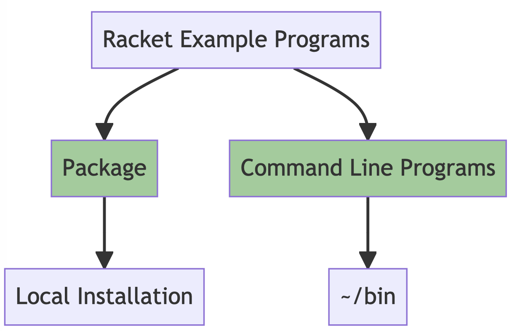

# Preface

Racket is a Lisp language. I have been using Lisp languages since the 1970s.

Dear reader, I love developing code in Lisp languages and my hope is that you will too. Racket is a "batteries included" language that includes a nice IDE, a great *standard library*, and many open source projects in the *Racket universe*.

In 1982 my company bought a Lisp Machine for my use. A Lisp Machine provided an "all batteries included" working environment, but now no one seriously uses Lisp Machines. In this book I try to lead you, dear reader, through a process of creating a "batteries included" working environment using Racket Scheme.

The latest edition is always available for purchase at [https://leanpub.com/racket-ai](https://leanpub.com/racket-ai).  You can also read free online at [https://leanpub.com/racket-ai/read](https://leanpub.com/racket-ai/read). I offer the purchase option for readers who wish to directly support my work.

This is a “live book:” there will never be a second edition. As I add material and make corrections, I simply update the book and the free to read online copy and all eBook formats for purchase get updated.

I have been developing commercial Artificial Intelligence (AI) tools and applications since the 1980s and I usually use the Lisp languages Common Lisp, Clojure, Racket Scheme, and Gambit Scheme. Here you will find Racket code that I wrote for my own use and I am wrapping in a book in the hopes that it will also be useful to you, dear reader.

I wrote this book for both professional programmers and home hobbyists who already know how to program in Racket (or another Scheme dialect) and who want to learn practical AI programming and information processing techniques. I have tried to make this an enjoyable book to work through. In the style of a “cook book,” the chapters can be read in any order. 

You can find the code examples and the files for the manuscript for this book in the following GitHub repository:

[https://github.com/mark-watson/Racket-AI-book](https://github.com/mark-watson/Racket-AI-book)

Git pull requests with code improvements for either the source code or manuscript markdown files will be appreciated by me and the readers of this book.

## Requests from the Author

This book will always be available to read free online at [https://leanpub.com/racket-ai/read](https://leanpub.com/racket-ai/read).

That said, I appreciate it when readers purchase my books because the income enables me to spend more time writing.

### Hire the Author as a Consultant

I am available for short consulting projects. Please see [https://markwatson.com](https://markwatson.com).

## License for Book Manuscript: Creative Commons

Copyright 2022-2024 Mark Watson. All rights reserved.

This book may be shared using the Creative Commons "share and share alike, no modifications, no commercial reuse" license.

## Book Example Programs

Here are the projects for this book:

- embeddingsdb - Vector database for embeddings. This project implements a vector database for storing and querying embeddings. It provides functionality for creating, storing, and retrieving vector representations of text or other data, which is crucial for many modern AI applications, especially those involving semantic search or similarity comparisons.
- kgn - Knowledge Graph Navigator. The Knowledge Graph Navigator is a tool for exploring and querying knowledge graphs. It includes utilities querying graph structures, executing queries, and visualizing relationships between entities. This can be particularly useful for working with semantic web technologies or large-scale knowledge bases.
- llmapis - Interfaces to various LLM APIs. This module provides interfaces to various Large Language Model APIs, including OpenAI, Anthropic, Mistral, and others. It offers for interact ing with different LLM providers, allowing users to easily switch between models or compare outputs from different services. This can be valuable for developers looking to integrate state-of-the-art language models into their applications.
- misc_code - Miscellaneous utility code. This directory contains various utility functions and examples for common programming tasks in Racket. It includes code for working with hash tables, parsing HTML, handling HTTP requests, and interacting with SQLite databases. These utilities can serve as building blocks for larger AI projects or as reference implementations for common tasks.
- nlp - Natural Language Processing utilities. The NLP module provides tools for natural language processing tasks. It includes implementations for part-of-speech tagging and named entity recognition. These fundamental NLP tasks are essential for many text analysis and understanding applications, making this module a valuable resource for developers working with textual data.
- pdf_chat - PDF text extraction. This project focuses on extracting text from PDF documents. It provides utilities for parsing PDF files and converting their content into plain text format. This can be particularly useful for applications that need to process or analyze information contained in PDF documents, such as document summarization or information retrieval systems.
- search_brave - Brave Search API wrapper. The Brave Search API wrapper provides an interface for interacting with the Brave search engine programmatically. It offers functions for sending queries and processing search results, making it easier to integrate Brave's search capabilities into Racket applications.
- sparql - SPARQL querying utilities for DBpedia. This module focuses on SPARQL querying, particularly for interacting with DBpedia. It includes utilities for constructing SPARQL queries, executing them against DBpedia's endpoint, and processing the results. This can be valuable for applications that need to extract structured information from large knowledge bases.
- webscrape - Web scraping utilities. The web scraping module provides tools for extracting information from websites. It includes functions for fetching web pages, parsing HTML content, and extracting specific data elements. These utilities can be useful for a wide range of applications, from data collection to automated information gathering and analysis.

The following diagram showing Racket software examples configured for your local laptop. There are several combined examples that build both to a Racket package that get installed locally, as well as command line programs that get built and deployed to **~/bin**. Other examples are either a command line tool or a Racket package.

## Racket, Scheme, and Common Lisp

I like Common Lisp slightly more than Racket and other Scheme dialects, even though Common Lisp is ancient and has defects. Then why do I use Racket?
Racket is a family of languages, a very good IDE, and a rich ecosystem supported by many core Racket developers and Racket library authors. Choosing Racket Scheme was an easy decision, but there are also other Scheme dialects that I enjoy using:

- Gambit/C Scheme
- Gerbil Scheme (based on Gambit/C)
- Chez Scheme

## Personal Artificial Intelligence Journey: or, Life as a Lisp Developer

I have been interested in AI since reading Bertram Raphael’s excellent book *Thinking Computer: Mind Inside Matter* in the early 1980s. I have also had the good fortune to work on many interesting AI projects including the development of commercial expert system tools for the Xerox LISP machines and the Apple Macintosh, development of commercial neural network tools, application of natural language and expert systems technology, medical information systems, application of AI technologies to Nintendo and PC video games, and the application of AI technologies to the financial markets. I have also applied statistical natural language processing techniques to analyzing social media data from Twitter and Facebook. I worked at Google on their Knowledge Graph and I managed a deep learning team at Capital One where I was awarded 55 US patents.

I enjoy AI programming, and hopefully this enthusiasm will also infect you.

## Acknowledgements

I produced the manuscript for this book using the [leanpub.com](http://leanpub.com) publishing system and I recommend leanpub.com to other authors.

**Editor: Carol Watson**

Thanks to the following people who found typos in this and earlier book editions: David Rupp.
