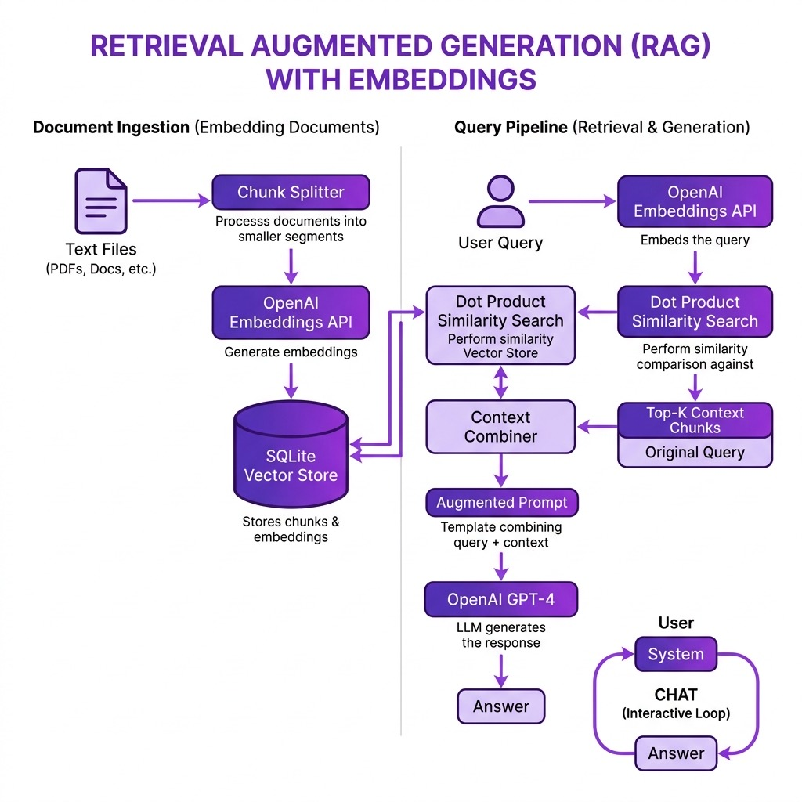

# Embeddings Database

**Book Chapter:** [Retrieval Augmented Generation of Text Using Embeddings](https://leanpub.com/racket-ai/read) — *Practical Artificial Intelligence Development With Racket* (free to read online).

This project provides a simple vector database implementation for managing and querying text embeddings, useful for building Retrieval-Augmented Generation (RAG) pipelines in Racket.

## Architecture

## Files

- `embeddingsdb.rkt` - The original RAG pipeline: chunking, SQLite vector store, OpenAI embeddings, semantic match, and a CHAT loop
- `main.rkt` - Thin wrapper that re-exports the library entry points
- `rag_extensions.rkt` - Offline extensions: cosine similarity, sentence-aware chunking with overlap, ranked top-k retrieval, prompt assembly, plus a deterministic local embedder for demos. Requires no API key
- `tests.rkt` - rackunit tests for the extensions; runs fully offline
- `data/` - Sample documents (`chemistry.txt`, `sports.txt`)

## Install as a local package

    raco pkg remove
    raco pkg install --scope user

If you change the source code, run the following to update the linked (installed in place) package **embeddingsdb**:

    raco make main.rkt

## Run

    racket main.rkt              # library entry points (needs OPENAI_API_KEY for live use)
    racket rag_extensions.rkt    # offline demo of retrieval and prompt assembly
    raco test tests.rkt          # offline test suite

## License and Copyright

This example is released using the Apache 2 license.
Copyright 2022-2026 Mark Watson. All rights reserved.
