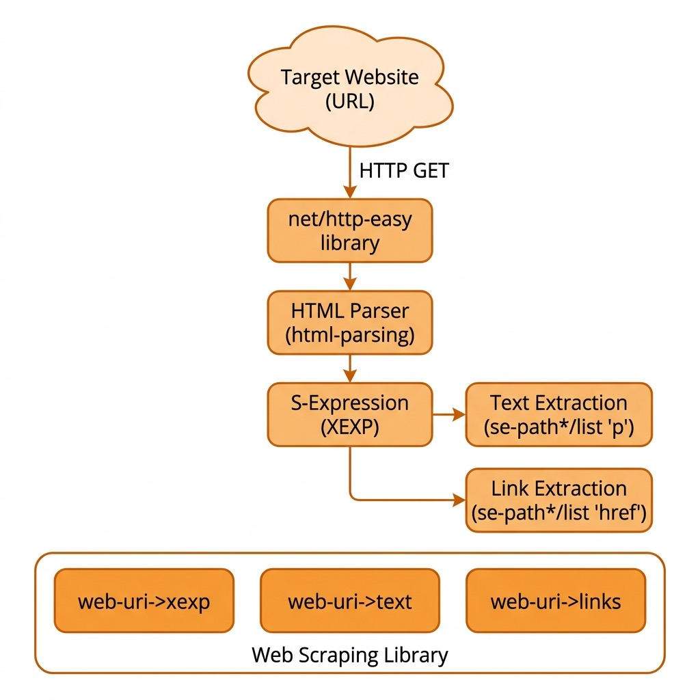

# Racket Web Scraping Library

**Book Chapter:** [Web Scraping](https://leanpub.com/racket-ai/read) — *Practical Artificial Intelligence Development With Racket* (free to read online).

This library provides foundational web scraping utilities in Racket, enabling you to extract raw text and data from web pages. This is highly useful for feeding external knowledge to LLMs.

## Functions

- **`web-uri->xexp`** — Fetch a web page and return its HTML as an XExp structure
- **`web-uri->text`** — Extract all paragraph text from a web page
- **`web-uri->links`** — Extract all external links (URLs starting with http) from a web page
- **`web-uri->html-headers`** — Extract H1, H2, and H3 headers from a web page, returns a list of lists

## Architecture

### Partial implementation

I will commit the complete library code here when it is feature complete.

## Run

    racket webscrape.rkt

## Tests

    racket test.rkt

## Demo

    racket demo.rkt

## License and Copyright

This example is released using the Apache 2 license.
Copyright 2022-2025 Mark Watson. All rights reserved.